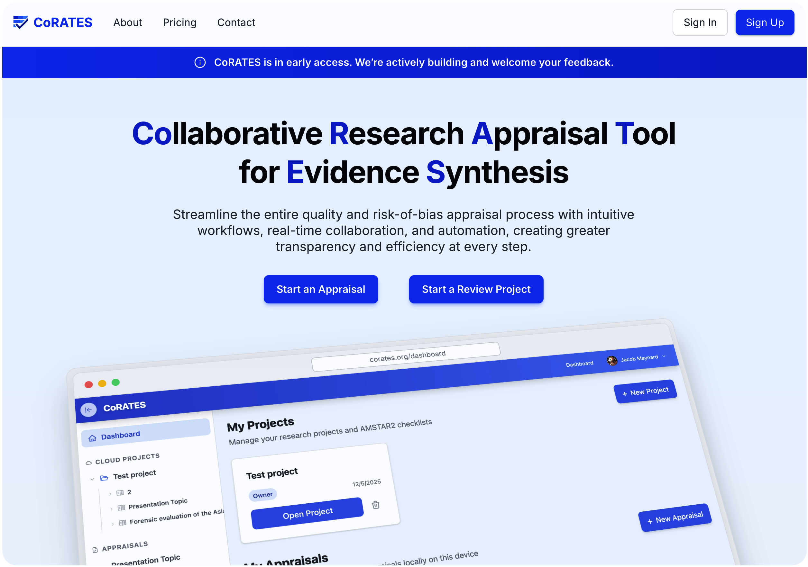

# CoRATES

### Collaborative Research Appraisal Tool for Evidence Synthesis

CoRATES is a web application designed to streamline the entire quality and risk-of-bias appraisal process with intuitive workflows, real-time collaboration, and automation, creating greater transparency and efficiency at every step. Built for researchers conducting evidence synthesis, it enables real-time collaboration, offline support, and PDF annotation.

  

## Getting Started

> See the detailed [Contributing Guide](.github/CONTRIBUTING.md) for step-by-step setup instructions.

> See detailed [Documentation](packages/docs/README.md) for more info.

> See the [Code of Conduct](.github/CODE_OF_CONDUCT.md).

> See [Security](.github/SECURITY.md).

## Tech Stack

### Frontend

- **Framework**: SolidJS with @solidjs/router for client-side routing
- **Build**: Vite with vite-plugin-solid (web package) / SolidStart with Vinxi (landing package)
- **Styling**: Tailwind CSS v4 with @tailwindcss/vite
- **UI Components**: Ark UI (via @corates/ui package) + solid-icons
- **Data Fetching**: TanStack SolidQuery (reactive server state management)
- **Tables**: TanStack Solid Table
- **Charts**: Chart.js + solid-chartjs
- **PDF Viewer**: EmbedPDF with plugin ecosystem
- **Local Storage**: Dexie (IndexedDB wrapper) with y-dexie for Yjs persistence
- **Forms & Validation**: Zod (schema validation)
- **Testing**: Vitest + @solidjs/testing-library + jsdom

### Backend

- **Runtime**: Cloudflare Workers (serverless edge compute)
- **Real-time**: Durable Objects (stateful computing for WebSocket connections)
- **Framework**: Hono (lightweight web framework for Workers)
- **Database**: Cloudflare D1 (serverless SQLite)
- **ORM**: Drizzle ORM with automatic migration generation (drizzle-kit)
- **Storage**: Cloudflare R2 (S3-compatible object storage for PDFs)
- **Auth**: Better Auth with Stripe integration for payments
- **Email**: Postmark for transactional emails
- **Validation**: Zod
- **Testing**: Vitest with @cloudflare/vitest-pool-workers

### Monorepo & Tooling

- **Package Manager**: pnpm with workspaces
- **Build Orchestration**: Turbo
- **Linting**: ESLint with custom CoRATES rules
- **Code Format**: Prettier
- **Type Safety**: TypeScript with jsconfig.json path aliases

### Sync & Collaboration

- **CRDT**: Yjs (Conflict-free Replicated Data Type)
- **WebSocket**: y-websocket for client-server sync
- **Local Persistence**: y-dexie for IndexedDB storage
- **Protocol**: y-protocols for Durable Objects communication

### Monorepo Structure

- `packages/web` - SolidJS frontend application with Vite
- `packages/landing` - Marketing site built with SolidStart (meta-framework) and Vinxi, includes bundled web app
- `packages/workers` - Cloudflare Workers backend
- `packages/ui` - Shared Ark UI component library with prestyled + primitive variants
- `packages/shared` - Shared TypeScript utilities, types, and error definitions
- `packages/docs` - Vitepress documentation and guides
- `packages/mcp` - MCP server for development tools and documentation

## License

PolyForm Noncommercial License 1.0.0 - see [LICENSE](./LICENSE) for details.

## Author

Jacob Maynard
