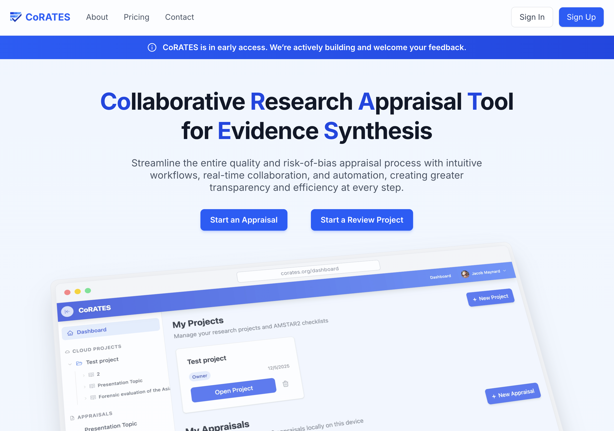

# CoRATES

**Collaborative Research Appraisal Tool for Evidence Synthesis**

CoRATES is a web application designed to streamline the entire quality and risk-of-bias appraisal process with intuitive workflows, real-time collaboration, and automation, creating greater transparency and efficiency at every step. Built for researchers conducting evidence synthesis, it enables real-time collaboration, offline support, and PDF annotation.

## Getting Started

> See the detailed [Contributing Guide](CONTRIBUTING.md) for step-by-step setup instructions.

## Tech Stack

- **Frontend**: SolidJS, SolidStart, Tailwind CSS, Vite, Zag
- **Backend**: Cloudflare Workers, Durable Objects
- **Database**: Cloudflare D1 (SQLite)
- **Storage**: Cloudflare R2 (PDF documents)
- **Sync**: Yjs (CRDT), y-indexeddb for local persistence
- **Auth**: BetterAuth

## License

PolyForm Noncommercial License 1.0.0 - see [LICENSE](./LICENSE) for details.

## Author

Jacob Maynard
