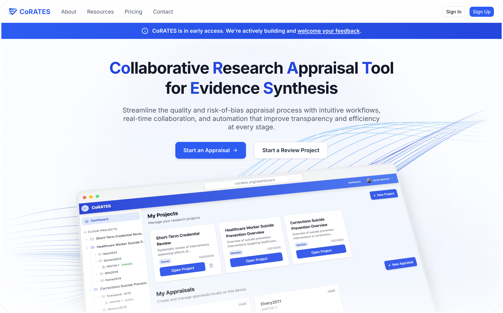

# CoRATES

### Collaborative Research Appraisal Tool for Evidence Synthesis

CoRATES is a web application designed to streamline the entire quality and risk-of-bias appraisal process with intuitive workflows, real-time collaboration, and automation, creating greater transparency and efficiency at every step. Built for researchers conducting evidence synthesis, it enables real-time collaboration, offline support, and PDF annotation.

  

## Getting Started

> See the detailed [Contributing Guide](.github/CONTRIBUTING.md) for step-by-step setup instructions.

> See detailed [Documentation](packages/docs/README.md) for more info.

> See the [Code of Conduct](.github/CODE_OF_CONDUCT.md).

> See [Security](.github/SECURITY.md).

## Tech Stack

### Frontend

- **Framework**: React 19 with TanStack Start and TanStack Router
- **Build**: Vite with TanStack Start
- **Styling**: Tailwind CSS v4 with @tailwindcss/vite
- **UI Components**: shadcn/ui (Radix-based) + lucide-react
- **Data Fetching**: TanStack Query (server state management)
- **Client State**: Zustand
- **Tables**: TanStack React Table
- **Charts**: D3 for user-facing charts, Recharts for admin dashboards
- **PDF Viewer**: EmbedPDF with plugin ecosystem
- **Local Storage**: Dexie (IndexedDB wrapper) with y-dexie for Yjs persistence
- **Forms & Validation**: Zod (schema validation)
- **Testing**: Vitest (unit + `@testing-library/react` + jsdom), vitest-browser-react for browser component tests, Playwright for e2e

### Backend

- **Runtime**: Cloudflare Workers (serverless edge compute)
- **API**: TanStack Start file-based server routes (in `packages/web/src/routes/api/`) served from the main app Worker
- **Stripe Webhook Worker**: Separate Hono-based Worker (`packages/stripe-purchases`) that receives and verifies Stripe webhooks, isolated from the main app for deploy-cadence reasons
- **Real-time**: Durable Objects (stateful computing for WebSocket connections)
- **Database**: Cloudflare D1 (serverless SQLite)
- **ORM**: Drizzle ORM with automatic migration generation (drizzle-kit)
- **Storage**: Cloudflare R2 (S3-compatible object storage for PDFs)
- **Auth**: Better Auth with org, admin, and Stripe integration for payments
- **Email**: Postmark for transactional emails
- **Validation**: Zod (for schema-heavy routes), ad-hoc type checks elsewhere
- **Testing**: Vitest with `@cloudflare/vitest-pool-workers` for server tests (real D1 + bindings)

### Monorepo & Tooling

- **Package Manager**: pnpm with workspaces
- **Build Orchestration**: Turbo
- **Linting**: ESLint with custom CoRATES rules
- **Code Format**: Prettier
- **AI Compatible**: Claude plugins and skills, Cursor rules, and VS Code instructions
- **Type Safety**: TypeScript with tsconfig.json path aliases

### Sync & Collaboration

- **CRDT**: Yjs (Conflict-free Replicated Data Type)
- **WebSocket**: y-websocket for client-server sync
- **Local Persistence**: y-dexie for IndexedDB storage
- **Protocol**: y-protocols for Durable Objects communication

### Monorepo Structure

- `packages/web` - React 19 / TanStack Start app, deployed as the main Cloudflare Worker (serves both the SPA and all `/api/*` routes)
- `packages/workers` - Shared backend library (auth, policies, billing resolvers, Durable Objects) imported by `packages/web`
- `packages/stripe-purchases` - Isolated Hono-based Cloudflare Worker for Stripe purchase webhooks
- `packages/db` - Drizzle schema, client, and typed helpers
- `packages/shared` - Shared TypeScript utilities, types, and domain error definitions
- `packages/ai` - AI-adjacent utilities
- `packages/docs` - VitePress documentation and guides
- `packages/stripe-dev` - Local Stripe listener setup for Turbo

## License

PolyForm Noncommercial License 1.0.0 - see [LICENSE](./LICENSE) for details.

## Author

Jacob Maynard
