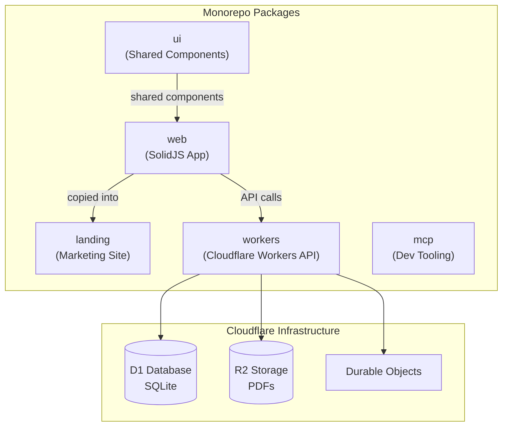

# Package Architecture

Overview of the monorepo structure and how packages relate to each other.

## Package Details

| Package   | Purpose                             | Tech                     |
| --------- | ----------------------------------- | ------------------------ |
| `web`     | Main SolidJS application            | SolidJS, Vite, Tailwind  |
| `workers` | Backend API and real-time sync      | Hono, Cloudflare Workers |
| `landing` | Marketing site (includes web app)   | SolidStart               |
| `ui`      | Shared component library            | SolidJS, Zag.js          |
| `mcp`     | Development tooling (docs, linting) | Node.js                  |
