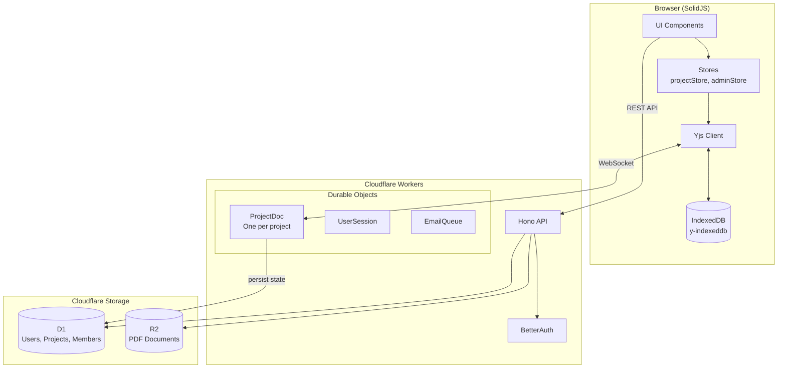

# System Architecture

How the frontend, backend, and storage layers connect.

## Key Components

### Frontend (SolidJS)

- **UI Components**: Zag.js-based accessible components
- **Stores**: Centralized state management (no prop drilling)
- **Yjs Client**: CRDT sync with local IndexedDB persistence

### Backend (Cloudflare Workers)

- **Hono API**: REST endpoints for CRUD operations
- **BetterAuth**: Authentication and session management
- **Durable Objects**: Stateful real-time collaboration

### Storage

- **D1**: SQLite database for relational data
- **R2**: Object storage for PDF documents
