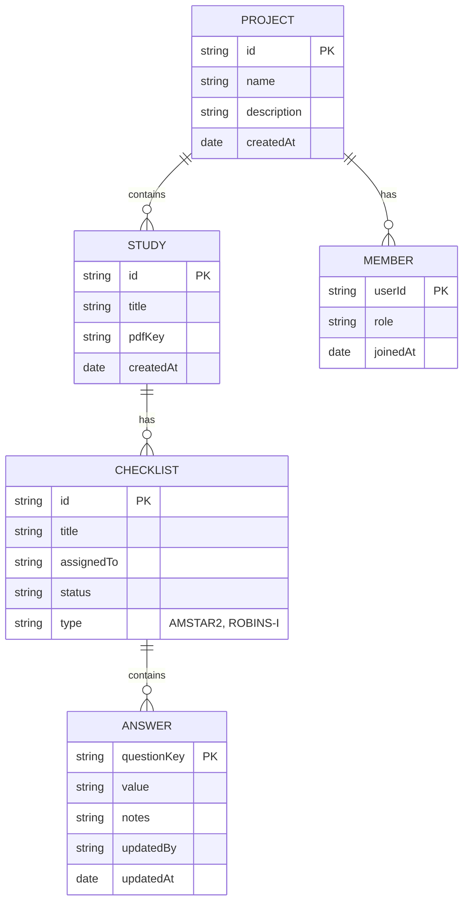

# Data Model

The hierarchical structure of data within a project.

## Entity Details

### Project

Top-level container for a research project. Holds all studies and team members.

### Study

A systematic review or research paper being assessed. Can have an associated PDF stored in R2.

### Checklist

An assessment using a specific tool (AMSTAR-2, ROBINS-I). Assigned to a team member.

### Answer

Individual response to a checklist question. Tracks who made the change and when.

## Storage Split

| Entity                       | Storage      | Reason                   |
| ---------------------------- | ------------ | ------------------------ |
| Users, Projects, Members     | D1 (SQLite)  | Relational queries, auth |
| Studies, Checklists, Answers | Yjs Document | Real-time sync, offline  |
| PDFs                         | R2           | Large binary files       |
