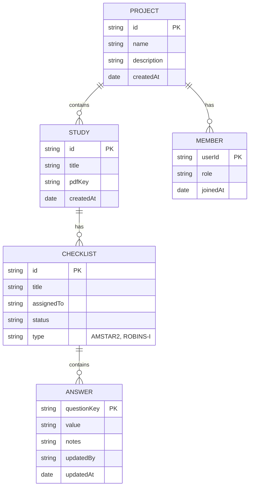

# Data Model

The hierarchical structure of data within a project.

## Entity Details

### Project

Top-level container for a research project. Basic metadata (id, name, description, createdBy) is stored in D1 for authorization and access control. Project content and collaborative data are stored in Durable Objects via Yjs.

### Study

A systematic review or research paper being assessed. Stored entirely in Durable Objects (Yjs Document). Can have an associated PDF stored in R2.

### Checklist

An assessment using a specific tool (AMSTAR-2, ROBINS-I). Stored entirely in Durable Objects (Yjs Document). Assigned to a team member.

### Answer

Individual response to a checklist question. Stored entirely in Durable Objects (Yjs Document). Tracks who made the change and when.

## Storage Split

| Entity                       | Storage                    | Reason                              |
| ---------------------------- | -------------------------- | ----------------------------------- |
| Users                        | D1 (SQLite)                | User accounts, authentication       |
| Projects (metadata)          | D1 (SQLite)                | Basic project info (id, name, description, createdBy, timestamps) - source of truth for access control |
| Project Members (relationships) | D1 (SQLite)            | Access control (who can access which projects) |
| Studies, Checklists, Answers | Durable Objects (Yjs Document) | All project content - real-time sync, offline collaboration |
| Project Metadata (synced)    | Durable Objects (Yjs Document) | Synced copy from D1 for real-time access |
| Project Members (synced)     | Durable Objects (Yjs Document) | Synced copy from D1 for real-time access |
| PDFs                         | R2                         | Large binary files                  |

**Architecture Notes**:
- **D1** stores project metadata (name, description, etc.) and membership relationships. This is the source of truth for authorization and access control.
- **Durable Objects** store the actual project content (studies, checklists, answers) in a Yjs Document, plus synced copies of metadata and members for real-time collaborative access.
- When a project is created, it's written to D1 first, then metadata is synced to the Durable Object.
- The Yjs Document enables real-time collaboration and offline support through CRDTs.
