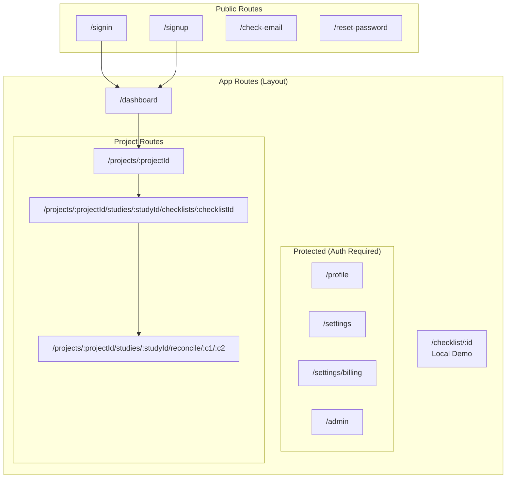

# Frontend Route Structure

Application routing and page hierarchy.

## Route Details

### Public Routes (AuthLayout)

No authentication required. Redirects to dashboard if already logged in.

| Route             | Component     | Purpose                   |
| ----------------- | ------------- | ------------------------- |
| `/signin`         | SignIn        | Email/password login      |
| `/signup`         | SignUp        | New account creation      |
| `/check-email`    | CheckEmail    | Email verification prompt |
| `/reset-password` | ResetPassword | Password recovery         |

### Protected Routes (ProtectedGuard)

Requires authentication. Redirects to signin if not logged in.

| Route               | Component      | Purpose                 |
| ------------------- | -------------- | ----------------------- |
| `/profile`          | ProfilePage    | User profile management |
| `/settings`         | SettingsPage   | App settings            |
| `/settings/billing` | BillingPage    | Subscription management |
| `/admin`            | AdminDashboard | Admin-only features     |

### Project Routes

| Route                          | Component             | Purpose                        |
| ------------------------------ | --------------------- | ------------------------------ |
| `/projects/:projectId`         | ProjectView           | Project overview, studies list |
| `/.../checklists/:checklistId` | ChecklistYjsWrapper   | Checklist assessment           |
| `/.../reconcile/:c1/:c2`       | ReconciliationWrapper | Compare two checklists         |
