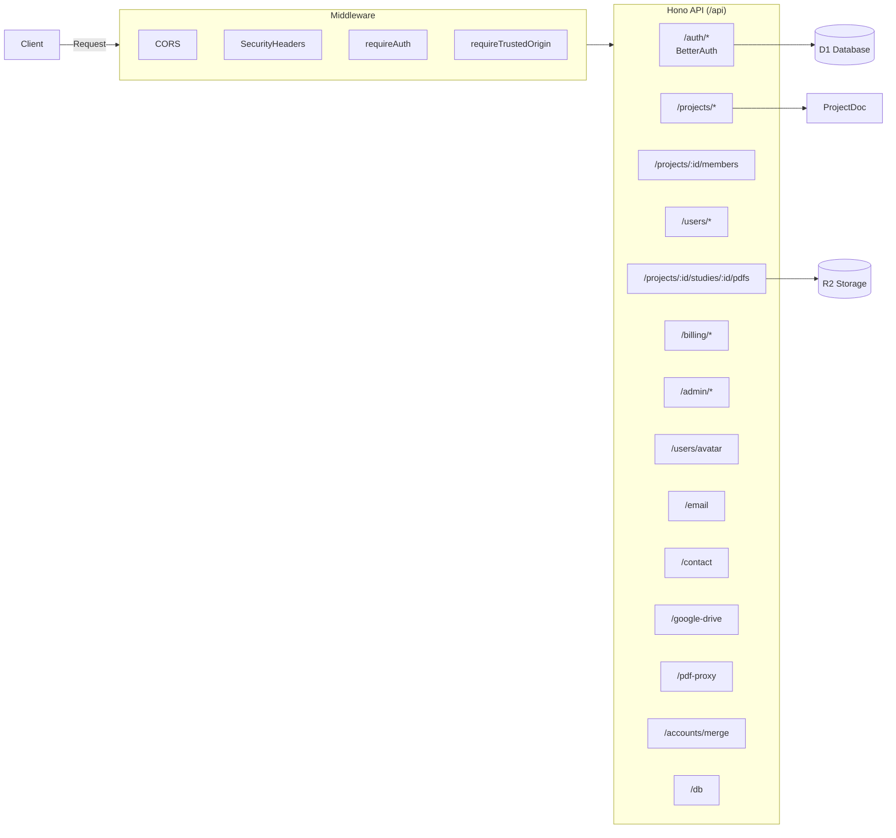

# API Routes Overview

Backend API structure and middleware.

## Middleware Stack

| Middleware             | Purpose                       |
| ---------------------- | ----------------------------- |
| `CORS`                 | Cross-origin request handling |
| `securityHeaders`      | Security headers (CSP, etc.)  |
| `requireAuth`          | JWT/session validation        |
| `requireTrustedOrigin` | CSRF protection               |

## API Endpoints

### Authentication (`/auth/*`)

Handled by BetterAuth. Includes signin, signup, session management.

### Projects (`/api/projects/*`)

- `GET /api/projects` - List user's projects
- `POST /api/projects` - Create new project
- `GET /api/projects/:id` - Get project details
- `DELETE /api/projects/:id` - Delete project

### Project Members (`/api/projects/:projectId/members`)

- `GET /api/projects/:projectId/members` - List project members
- `POST /api/projects/:projectId/members` - Add member to project
- `PATCH /api/projects/:projectId/members/:userId` - Update member role
- `DELETE /api/projects/:projectId/members/:userId` - Remove member

### PDFs (`/api/projects/:projectId/studies/:studyId/pdfs`)

- `POST /api/projects/:projectId/studies/:studyId/pdfs` - Upload PDF to R2
- `GET /api/projects/:projectId/studies/:studyId/pdfs/:key` - Download PDF from R2
- `DELETE /api/projects/:projectId/studies/:studyId/pdfs/:key` - Remove PDF

### PDF Proxy (`/api/pdf-proxy`)

- `POST /api/pdf-proxy` - Proxy external PDF URLs to avoid CORS issues

### Users (`/api/users/*`)

- `GET /api/users/search` - Search users
- `GET /api/users/avatar` - Get user avatar
- `POST /api/users/avatar` - Upload user avatar

### Account Merge (`/api/accounts/merge`)

- `POST /api/accounts/merge` - Merge two user accounts

### Billing (`/api/billing/*`)

Stripe integration for subscriptions and payments:

- `GET /api/billing/subscription` - Get user subscription
- `POST /api/billing/checkout` - Create Stripe checkout session
- `POST /api/billing/portal` - Create Stripe customer portal session
- `POST /api/billing/webhooks` - Stripe webhook handler

### Admin (`/api/admin/*`)

Admin-only endpoints for user management and system stats.

### Email (`/api/email`)

Email sending endpoints for notifications and transactional emails.

### Contact (`/api/contact`)

Public contact form submission endpoint.

### Google Drive (`/api/google-drive`)

Google Drive integration endpoints for importing documents.

### Database (`/api/db/*`)

Development/diagnostic endpoints:

- `GET /api/db/users` - List users (development only)

### Durable Object Routes

These routes connect to Durable Objects directly:

- `/api/project/:projectId` - ProjectDoc WebSocket connection for Yjs sync
- `/api/sessions/:sessionId` - UserSession WebSocket connection
