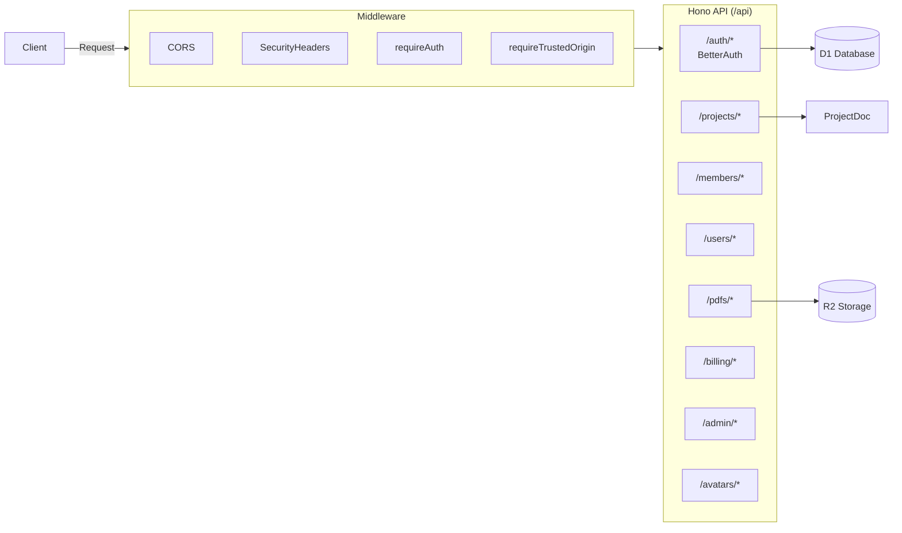

# API Routes Overview

Backend API structure and middleware.

## Middleware Stack

| Middleware             | Purpose                       |
| ---------------------- | ----------------------------- |
| `CORS`                 | Cross-origin request handling |
| `securityHeaders`      | Security headers (CSP, etc.)  |
| `requireAuth`          | JWT/session validation        |
| `requireTrustedOrigin` | CSRF protection               |

## API Endpoints

### Authentication (`/auth/*`)

Handled by BetterAuth. Includes signin, signup, session management.

### Projects (`/projects/*`)

- `GET /projects` - List user's projects
- `POST /projects` - Create new project
- `GET /projects/:id` - Get project details
- `DELETE /projects/:id` - Delete project

### PDFs (`/pdfs/*`)

- `POST /pdfs/upload` - Upload PDF to R2
- `GET /pdfs/:key` - Download PDF from R2
- `DELETE /pdfs/:key` - Remove PDF

### Billing (`/billing/*`)

Stripe integration for subscriptions and payments.

### Admin (`/admin/*`)

Admin-only endpoints for user management and system stats.
