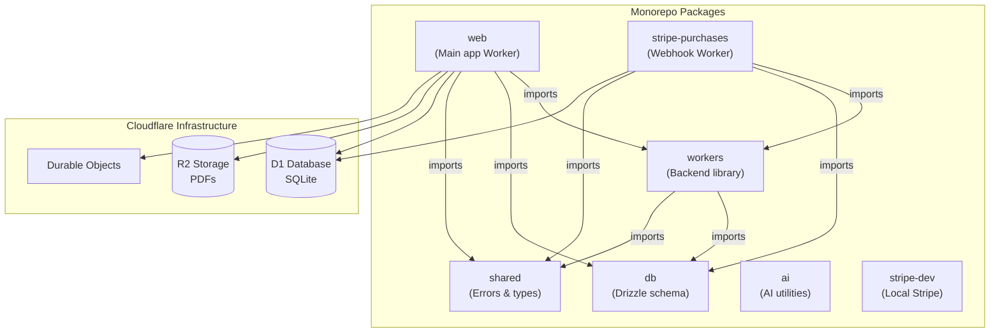

# Package Architecture

Overview of the monorepo structure and how packages relate to each other.

## Package Details

| Package            | Purpose                                                          | Tech                                                |
| ------------------ | ---------------------------------------------------------------- | --------------------------------------------------- |
| `web`              | Main app Worker: SPA + `/api/*` routes                           | React 19, TanStack Start, Vite, Tailwind, shadcn/ui |
| `stripe-purchases` | Isolated Stripe webhook Worker                                   | Hono, Cloudflare Workers                            |
| `workers`          | Backend library: Durable Objects, auth, policies, billing logic  | Cloudflare Workers, Better Auth, Drizzle            |
| `db`               | Drizzle schema, client, typed helpers                            | Drizzle ORM                                         |
| `shared`           | Shared TypeScript types and domain error definitions             | TypeScript                                          |
| `ai`               | AI-adjacent utilities                                            | TypeScript                                          |
| `stripe-dev`       | Local Stripe listener setup (Turbo-only, not deployed)           | Node scripts                                        |
| `docs`             | VitePress documentation                                          | VitePress                                           |
