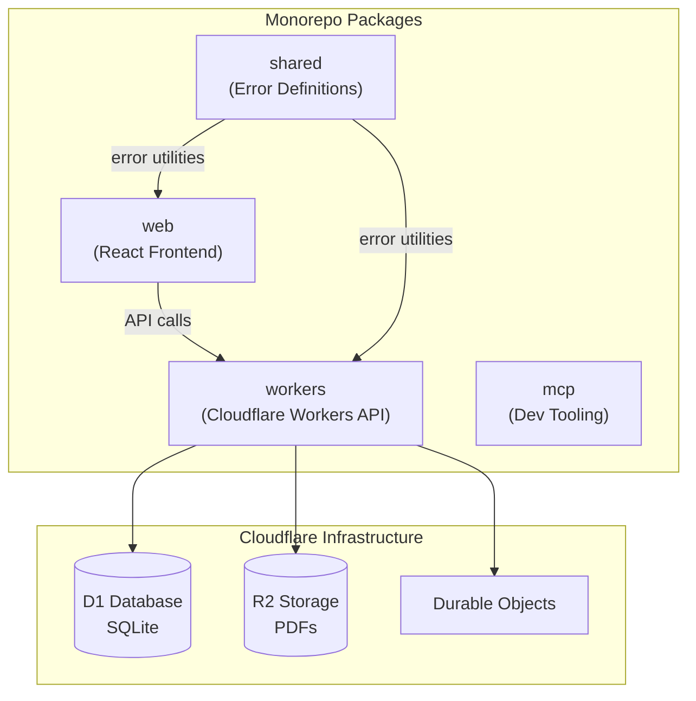

# Package Architecture

Overview of the monorepo structure and how packages relate to each other.

## Package Details

| Package   | Purpose                                | Tech                                  |
| --------- | -------------------------------------- | ------------------------------------- |
| `web`     | React frontend application             | React, TanStack Start, Vite, Tailwind |
| `workers` | Backend API and real-time sync         | OpenAPIHono, Cloudflare Workers       |
| `shared`  | Shared error definitions and utilities | TypeScript                            |
| `mcp`     | Development tooling (docs, linting)    | Node.js                               |
