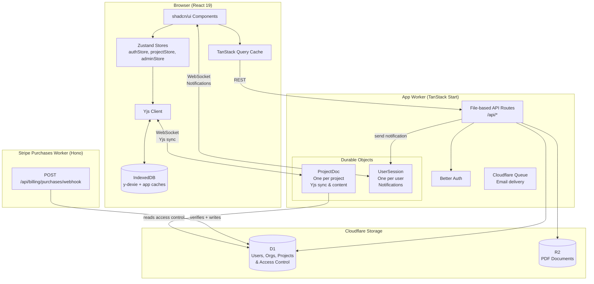

# System Architecture

How the frontend, backend, and storage layers connect.

```mermaid
flowchart TB
    subgraph Client["Browser (React 19)"]
        UI[shadcn/ui Components]
        Stores[Zustand Stores<br/>authStore, projectStore, adminStore]
        Query[TanStack Query Cache]
        YjsClient[Yjs Client]
        IDB[(IndexedDB<br/>y-dexie + app caches)]
    end

    subgraph MainWorker["App Worker (TanStack Start)"]
        Routes[File-based API Routes<br/>/api/*]
        Auth[Better Auth]

        subgraph DurableObjects["Durable Objects"]
            ProjectDoc[ProjectDoc<br/>One per project<br/>Yjs sync & content]
            UserSession[UserSession<br/>One per user<br/>Notifications]
        end
        EmailQueue[Cloudflare Queue<br/>Email delivery]
    end

    subgraph StripeWorker["Stripe Purchases Worker (Hono)"]
        StripeWebhook[POST /api/billing/purchases/webhook]
    end

    subgraph Storage["Cloudflare Storage"]
        D1[(D1<br/>Users, Orgs, Projects<br/>& Access Control)]
        R2[(R2<br/>PDF Documents)]
    end

    UI --> Stores
    UI --> Query
    Stores --> YjsClient
    YjsClient <-->|"WebSocket<br/>Yjs sync"| ProjectDoc
    YjsClient <--> IDB
    UI <-->|"WebSocket<br/>Notifications"| UserSession
    Query -->|"REST"| Routes
    Routes --> Auth
    Routes --> D1
    Routes --> R2
    Routes -->|"send notification"| UserSession
    StripeWebhook -->|"verifies + writes"| D1
    ProjectDoc -->|"reads access control"| D1
```

## Key Components

### Frontend (React 19)

- **UI**: shadcn/ui primitives colocated under `@/components/ui/`, styled with Tailwind v4
- **Routing**: TanStack Router file-based routes under `packages/web/src/routes/`
- **Client state**: Zustand stores in `@/stores/` (authStore, projectStore, adminStore, pdfPreviewStore)
- **Server state**: TanStack Query, with hooks in `@/hooks/`
- **Yjs Client**: CRDT sync with `y-dexie` for project content, alongside other app data in a single IndexedDB
- **Notification WebSocket**: Real-time connection to UserSession for user-level notifications (project invites, etc.)

### Backend (Cloudflare Workers)

Two Workers are deployed:

- **App Worker (`packages/web`)**: TanStack Start -- serves the SPA and all `/api/*` routes. Shared backend logic lives in `@corates/workers` (imported as a library).
- **Stripe Purchases Worker (`packages/stripe-purchases`)**: Hono-based, isolated for deploy-cadence. Receives Stripe webhooks, verifies signatures, writes to the same D1 database.

Both Workers share:

- **Better Auth**: Authentication and session management (in the main app Worker; the Stripe worker does not authenticate user sessions)
- **Durable Objects**:
  - **ProjectDoc**: One per project, holds Yjs document for real-time collaboration and content storage
  - **UserSession**: One per user, manages WebSocket connections for real-time notifications (e.g., project invites)
- **Cloudflare Queue**: Async email delivery with retries and dead letter queue, consumed by Postmark

### Storage

- **D1**: SQLite database for users, project metadata (id, name, description), and access control (project_members table). Source of truth for authorization.
- **Durable Objects**:
  - **ProjectDoc**: Persistent storage for Yjs documents containing all project content (studies, checklists, answers) and synced metadata. One ProjectDoc per project.
  - **UserSession**: Stores pending notifications when users are offline, manages WebSocket connections for real-time delivery. One UserSession per user.
- **R2**: Object storage for PDF documents

### UserSession Notification Flow

The `UserSession` Durable Object enables real-time, user-level notifications:

1. **When events occur** (e.g., user added to project), the Hono API sends a notification to that user's UserSession DO
2. **If the user is connected** via WebSocket, the notification is immediately delivered
3. **If the user is offline**, the notification is stored as "pending" and delivered when they reconnect
4. **Frontend connects** to `/api/sessions/:userId` via WebSocket to receive notifications in real-time

This is separate from ProjectDoc WebSockets, which handle collaborative editing of project content. UserSession handles user-level events like project invitations, membership changes, etc.
