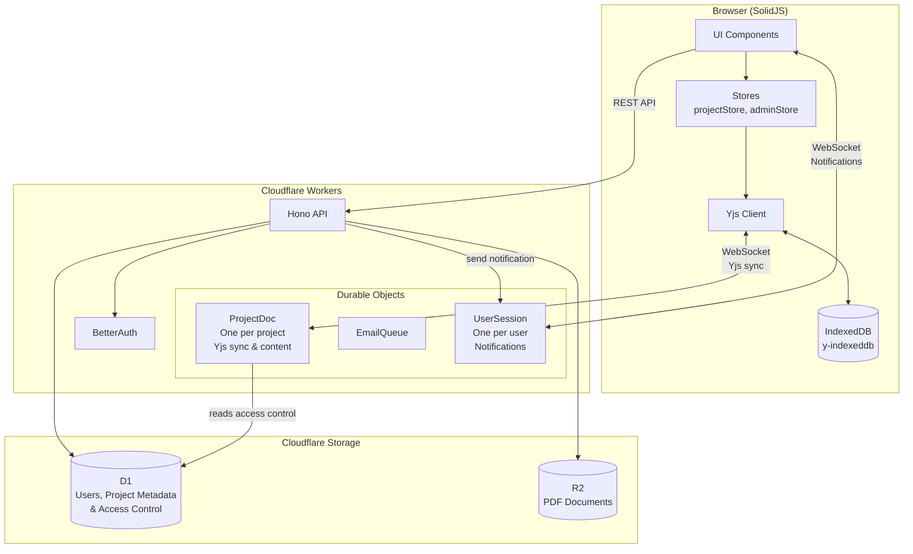

# System Architecture

How the frontend, backend, and storage layers connect.

## Key Components

### Frontend (SolidJS)

- **UI Components**: Ark UI-based accessible components
- **Stores**: Centralized state management (no prop drilling)
- **Yjs Client**: CRDT sync with local IndexedDB persistence for project content
- **Notification WebSocket**: Real-time connection to UserSession for user-level notifications (project invites, etc.)

### Backend (Cloudflare Workers)

- **Hono API**: REST endpoints for CRUD operations
- **BetterAuth**: Authentication and session management
- **Durable Objects**:
  - **ProjectDoc**: One per project, holds Yjs document for real-time collaboration and content storage
  - **UserSession**: One per user, manages WebSocket connections for real-time notifications (e.g., project invites)
  - **EmailQueue**: Background email processing

### Storage

- **D1**: SQLite database for users, project metadata (id, name, description), and access control (project_members table). Source of truth for authorization.
- **Durable Objects**:
  - **ProjectDoc**: Persistent storage for Yjs documents containing all project content (studies, checklists, answers) and synced metadata. One ProjectDoc per project.
  - **UserSession**: Stores pending notifications when users are offline, manages WebSocket connections for real-time delivery. One UserSession per user.
- **R2**: Object storage for PDF documents

### UserSession Notification Flow

The `UserSession` Durable Object enables real-time, user-level notifications:

1. **When events occur** (e.g., user added to project), the Hono API sends a notification to that user's UserSession DO
2. **If the user is connected** via WebSocket, the notification is immediately delivered
3. **If the user is offline**, the notification is stored as "pending" and delivered when they reconnect
4. **Frontend connects** to `/api/sessions/:userId` via WebSocket to receive notifications in real-time

This is separate from ProjectDoc WebSockets, which handle collaborative editing of project content. UserSession handles user-level events like project invitations, membership changes, etc.
