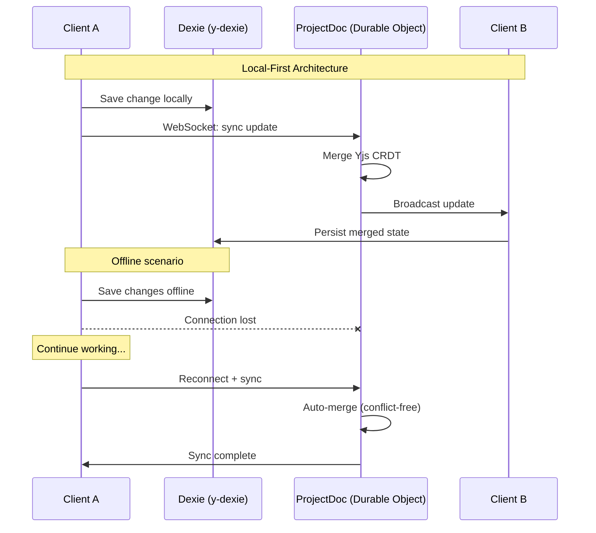

# Real-Time Sync Flow (CRDT)

How local-first sync works with Yjs CRDTs.

## How It Works

### Local-First Principles

1. **All changes are local first** - Data saves to Dexie immediately via y-dexie
2. **Background sync** - Changes push to server when connected
3. **Conflict-free** - Yjs CRDTs automatically merge concurrent edits

### Offline Support

- Users can continue working without internet
- Changes queue locally in Dexie (unified database)
- On reconnect, all changes sync and merge automatically

### Durable Objects

- One `ProjectDoc` per project holds the authoritative Yjs document
- WebSocket connections enable real-time collaboration
- State persists across worker restarts
