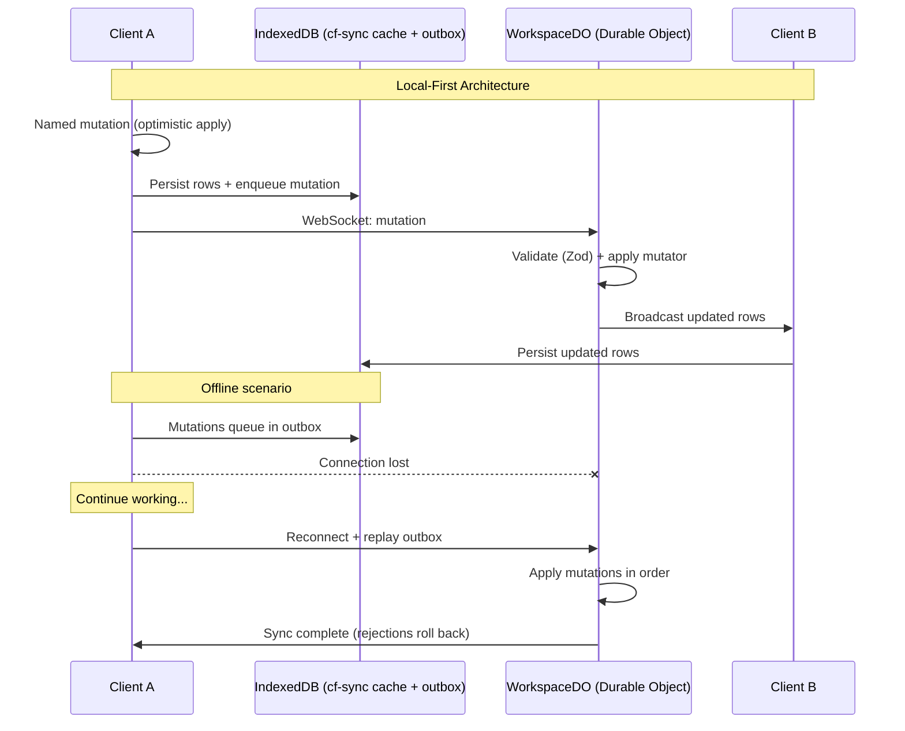

# Real-Time Sync Flow

How local-first sync works on the cf-sync engine.

```mermaid
sequenceDiagram
    participant Client1 as Client A
    participant Cache as IndexedDB (cf-sync cache + outbox)
    participant DO as WorkspaceDO (Durable Object)
    participant Client2 as Client B

    Note over Client1,Client2: Local-First Architecture

    Client1->>Client1: Named mutation (optimistic apply)
    Client1->>Cache: Persist rows + enqueue mutation
    Client1->>DO: WebSocket: mutation
    DO->>DO: Validate (Zod) + apply mutator
    DO->>Client2: Broadcast updated rows
    Client2->>Cache: Persist updated rows

    Note over Client1,Cache: Offline scenario
    Client1->>Cache: Mutations queue in outbox
    Client1--xDO: Connection lost
    Note over Client1: Continue working...
    Client1->>DO: Reconnect + replay outbox
    DO->>DO: Apply mutations in order
    DO->>Client1: Sync complete (rejections roll back)
```

## How It Works

### Local-First Principles

1. **All changes are local first** - Mutations apply optimistically and persist to the per-project `cf-sync:<projectId>` IndexedDB database immediately
2. **Background sync** - A durable outbox pushes mutations to the server when connected
3. **Conflict handling** - Rows are last-writer-wins upserts; flat-keyed answer rows carry only the fields that changed, so concurrent edits to different fields do not clobber each other. Yjs CRDTs remain only for reconciliation consolidated notes.

### Offline Support

- Users can continue working without internet
- Mutations queue locally in the outbox
- On reconnect, the outbox replays in order; rejected mutations roll back the optimistic overlay and surface a toast

### Durable Objects

- One `WorkspaceDO` per project holds the authoritative row collections
- WebSocket connections (`/api/sync/:projectId`) enable real-time collaboration
- State persists across worker restarts
