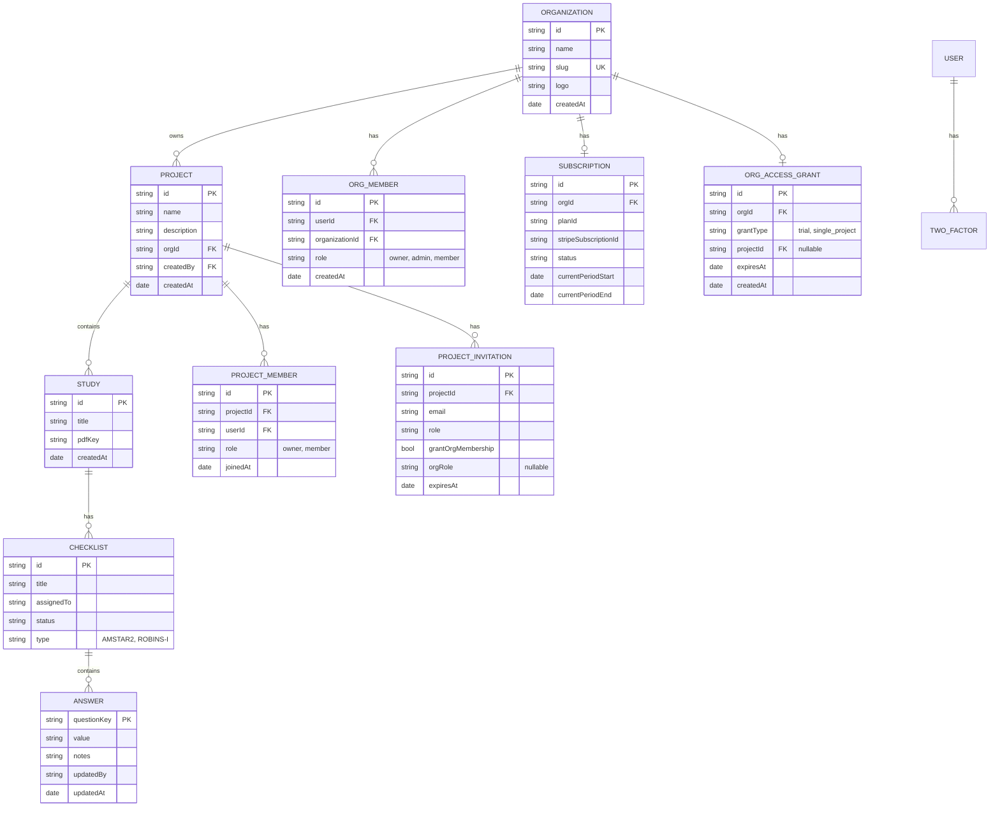

# Data Model

The hierarchical structure of data within CoRATES, including organizations, projects, and collaborative content.

## Entity Details

### Organization

Top-level workspace container. Organizations group projects and team members. Managed by Better Auth organization plugin. Stored in D1.

**Role hierarchy:** `owner > admin > member`

### Project

Research project container belonging to an organization. Basic metadata (id, name, description, orgId, createdBy) stored in D1 for authorization. Content stored in Durable Objects via Yjs.

**Role hierarchy:** `owner > member`

### Study

A systematic review or research paper being assessed. Stored entirely in Durable Objects (Yjs Document). Can have an associated PDF stored in R2.

### Checklist

An assessment using a specific tool (AMSTAR-2, ROBINS-I). Stored entirely in Durable Objects (Yjs Document). Assigned to a team member.

### Answer

Individual response to a checklist question. Stored entirely in Durable Objects (Yjs Document). Tracks who made the change and when.

## Storage Split

| Entity                       | Storage                        | Reason                                                                                            |
| ---------------------------- | ------------------------------ | ------------------------------------------------------------------------------------------------- |
| Users                        | D1 (SQLite)                    | User accounts, authentication                                                                     |
| Organizations                | D1 (SQLite)                    | Org metadata, Better Auth plugin                                                                  |
| Org Members                  | D1 (SQLite)                    | Org membership and roles                                                                          |
| Subscriptions                | D1 (SQLite)                    | Stripe subscriptions per org (Better Auth Stripe plugin)                                          |
| Org Access Grants            | D1 (SQLite)                    | Time-limited access (trials, single project purchases)                                            |
| Projects (metadata)          | D1 (SQLite)                    | Basic project info (id, name, description, orgId, createdBy) - source of truth for access control |
| Project Members              | D1 (SQLite)                    | Project-level access control (who can access which projects)                                      |
| Project Invitations          | D1 (SQLite)                    | Pending invitations with org and project context, optional org membership grant                   |
| Two-Factor Auth              | D1 (SQLite)                    | 2FA secrets and backup codes (Better Auth plugin)                                                 |
| Stripe Event Ledger          | D1 (SQLite)                    | Webhook audit log with two-phase trust model                                                      |
| Studies, Checklists, Answers | Durable Objects (Yjs Document) | All project content - real-time sync, offline collaboration                                       |
| Project Metadata (synced)    | Durable Objects (Yjs Document) | Synced copy from D1 for real-time access                                                          |
| Project Members (synced)     | Durable Objects (Yjs Document) | Synced copy from D1 for real-time access                                                          |
| PDFs                         | R2                             | Large binary files                                                                                |

## Architecture Notes

- **Organizations** are the top-level multi-tenant boundary. Users can belong to multiple orgs.
- **D1** stores organization, project metadata, membership relationships, subscriptions, and access grants. This is the source of truth for authorization and access control.
- **Durable Objects** store the actual project content (studies, checklists, answers) in a Yjs Document, plus synced copies of metadata and members for real-time collaborative access.
- When a project is created, it's written to D1 first (with orgId), then metadata is synced to the Durable Object.
- **Project invitations** include `orgId`, `orgRole`, and `grantOrgMembership` flag so accepting an invitation can optionally grant both org and project membership.
- **Subscriptions** are managed via Better Auth's Stripe plugin and synced via webhooks.
- **Access grants** provide time-limited upgrades (trials, single-project purchases) that override the base plan.
- The Yjs Document enables real-time collaboration and offline support through CRDTs.
