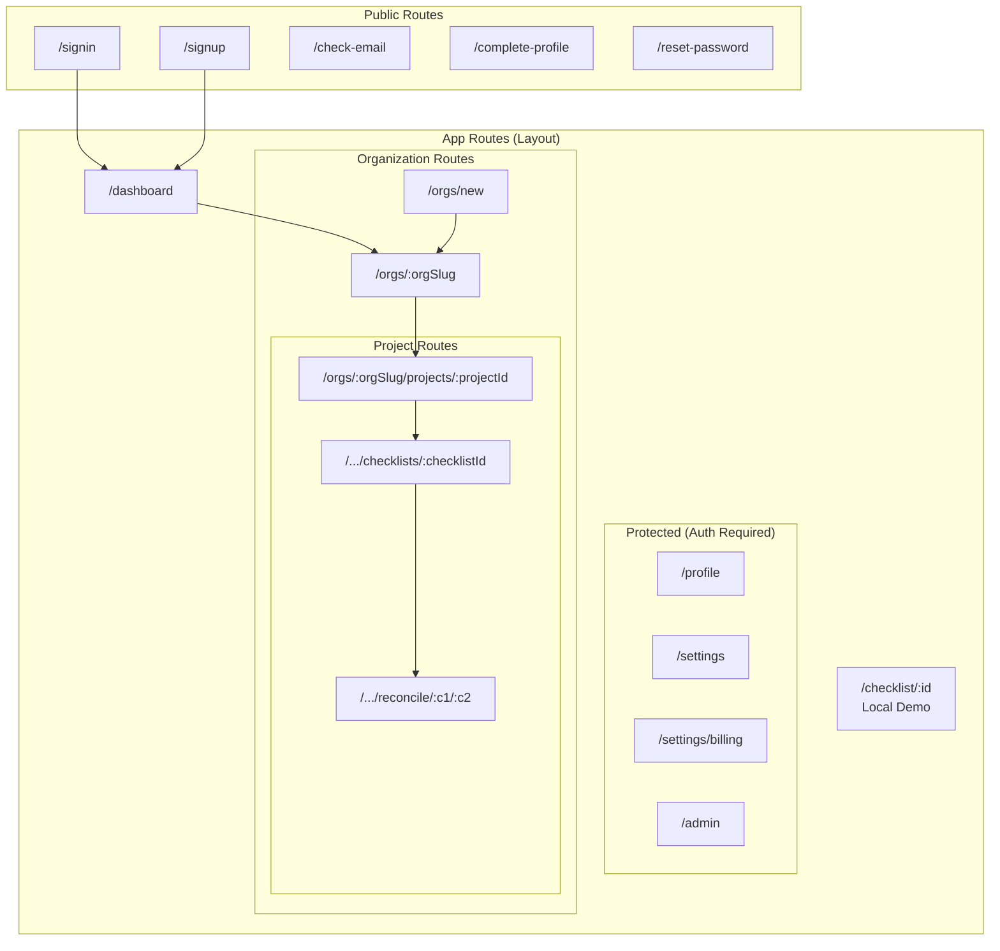

# Frontend Route Structure

Application routing and page hierarchy with organization-scoped routes.

## Route Details

### Public Routes (AuthLayout)

No authentication required. Redirects to dashboard if already logged in.

| Route               | Component       | Purpose                   |
| ------------------- | --------------- | ------------------------- |
| `/signin`           | SignIn          | Email/password login      |
| `/signup`           | SignUp          | New account creation      |
| `/check-email`      | CheckEmail      | Email verification prompt |
| `/complete-profile` | CompleteProfile | Initial profile setup     |
| `/reset-password`   | ResetPassword   | Password recovery         |

### Protected Routes (ProtectedGuard)

Requires authentication. Redirects to signin if not logged in.

| Route               | Component      | Purpose                 |
| ------------------- | -------------- | ----------------------- |
| `/profile`          | ProfilePage    | User profile management |
| `/settings`         | SettingsPage   | App settings            |
| `/settings/billing` | BillingPage    | Subscription management |
| `/admin`            | AdminDashboard | Admin-only features     |

### Organization Routes

| Route            | Component       | Purpose                               |
| ---------------- | --------------- | ------------------------------------- |
| `/orgs/new`      | CreateOrgPage   | Create new organization               |
| `/orgs/:orgSlug` | OrgProjectsPage | Organization dashboard, projects list |

### Project Routes (Org-Scoped)

All project routes are scoped under organizations using `orgSlug` in the URL.

| Route                                                                         | Component             | Purpose                        |
| ----------------------------------------------------------------------------- | --------------------- | ------------------------------ |
| `/orgs/:orgSlug/projects/:projectId`                                          | ProjectView           | Project overview, studies list |
| `/orgs/:orgSlug/projects/:projectId/studies/:studyId/checklists/:checklistId` | ChecklistYjsWrapper   | Checklist assessment           |
| `/orgs/:orgSlug/projects/:projectId/studies/:studyId/reconcile/:c1/:c2`       | ReconciliationWrapper | Compare two checklists         |

### Local Routes

Routes for local-only checklists (no authentication required, stored in Dexie/IndexedDB).

| Route                     | Component          | Purpose                     |
| ------------------------- | ------------------ | --------------------------- |
| `/checklist/:checklistId` | LocalChecklistView | Local-only checklist editor |

## Organization Context

Frontend routes use `orgSlug` (e.g., `my-lab`) for human-readable URLs. The backend API uses `orgId` (UUID).

The `useOrgContext` primitive resolves `orgSlug` from URL params to the current organization object. The `useOrgProjectContext` primitive combines org context with project context for project-level routes.

See the [Organizations Guide](/guides/organizations) for details on these primitives.
