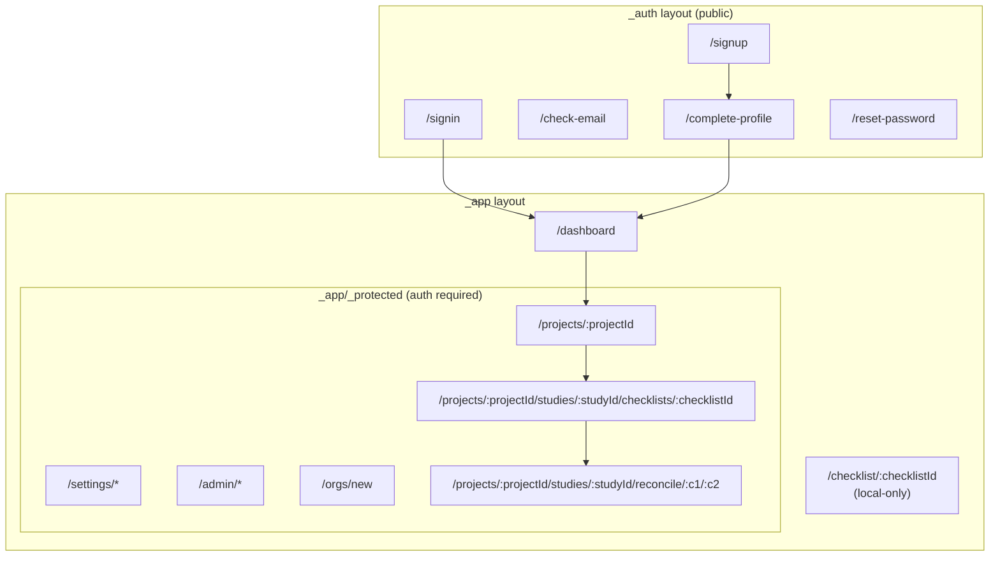

# Frontend Route Structure

Application routing under TanStack Router (file-based). Routes are **project-centric** -- there is no `orgSlug` in URLs. Files live under `packages/web/src/routes/`.

```mermaid
flowchart TD
    subgraph Public["_auth layout (public)"]
        signin["/signin"]
        signup["/signup"]
        checkemail["/check-email"]
        completeprofile["/complete-profile"]
        resetpw["/reset-password"]
    end

    subgraph App["_app layout"]
        dashboard["/dashboard"]
        localcheck["/checklist/:checklistId<br/>(local-only)"]

        subgraph Protected["_app/_protected (auth required)"]
            settings["/settings/*"]
            admin["/admin/*"]
            createorg["/orgs/new"]
            projectview["/projects/:projectId"]
            checklistview["/projects/:projectId/studies/:studyId/checklists/:checklistId"]
            reconcile["/projects/:projectId/studies/:studyId/reconcile/:c1/:c2"]
        end
    end

    signin --> dashboard
    signup --> completeprofile
    completeprofile --> dashboard
    dashboard --> projectview
    projectview --> checklistview
    checklistview --> reconcile
```

## Layouts

TanStack file-based conventions: an underscore prefix (`_app`, `_auth`) denotes a layout that wraps its children without contributing a path segment.

| Layout            | File                              | Purpose                                               |
| ----------------- | --------------------------------- | ----------------------------------------------------- |
| `_auth`           | `routes/_auth.tsx`                | Public flows; redirects to `/dashboard` if logged in  |
| `_app`            | `routes/_app.tsx`                 | Top-level app chrome                                  |
| `_app/_protected` | `routes/_app/_protected.tsx`      | Auth guard via `beforeLoad` + `selectIsLoggedIn`      |

## Public routes (`_auth`)

| Route                 | File                                   | Purpose                   |
| --------------------- | -------------------------------------- | ------------------------- |
| `/signin`             | `routes/_auth/signin.tsx`              | Email/password + OAuth    |
| `/signup`             | `routes/_auth/signup.tsx`              | New account               |
| `/check-email`        | `routes/_auth/check-email.tsx`         | Email verification prompt |
| `/complete-profile`   | `routes/_auth/complete-profile.tsx`    | Post-signup + invitations |
| `/reset-password`     | `routes/_auth/reset-password.tsx`      | Password recovery         |

## Authenticated routes (`_app/_protected`)

| Route                                                                    | Purpose                                 |
| ------------------------------------------------------------------------ | --------------------------------------- |
| `/dashboard`                                                             | Project list                            |
| `/orgs/new`                                                              | Create a new organization               |
| `/projects/:projectId`                                                   | Project overview (studies, members)     |
| `/projects/:projectId/studies/:studyId/checklists/:checklistId`          | Checklist assessment                    |
| `/projects/:projectId/studies/:studyId/reconcile/:c1Id/:c2Id`            | Reconcile two reviewers' checklists     |
| `/settings/*`                                                            | Profile, billing, plans, notifications, 2FA  |
| `/admin/*`                                                               | Admin-only dashboards and tools         |

## Local-only routes

| Route                     | File                                   | Purpose                              |
| ------------------------- | -------------------------------------- | ------------------------------------ |
| `/checklist/:checklistId` | `routes/_app/checklist.$checklistId.tsx` | Local-only demo checklist, stored in Dexie/IndexedDB -- no auth required |

## URL contract

- **Project IDs, not slugs.** The URL contains `projectId`, not an org slug. The project's `orgId` is resolved from the store / query cache via `useProjectOrgId(projectId)`.
- **orgId does not appear in frontend URLs.** It only shows up in backend API paths (`/api/orgs/:orgId/...`).
- **Admin routes use explicit orgId/projectId/userId in the URL** for admin-only navigation, but those are not part of the public contract.

See the [Organizations Guide](/guides/organizations#frontend-routing) for the reasoning and the hooks (`useOrgs`, `useProjectOrgId`) used to resolve context.
