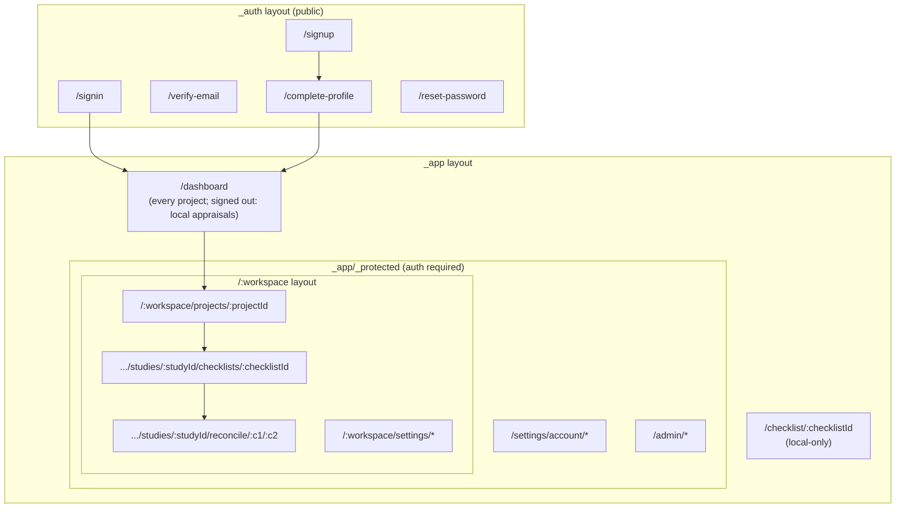

# Frontend Route Structure

Application routing under TanStack Router (file-based). Project pages and workspace settings live under the **workspace slug** (`/<slug>/projects/...`, `/<slug>/settings/...`). Home stays at `/dashboard` and lists every project, so workspaces stay out of the way. Files live under `packages/web/src/routes/`.

```mermaid
flowchart TD
    subgraph Public["_auth layout (public)"]
        signin["/signin"]
        signup["/signup"]
        verifyemail["/verify-email"]
        completeprofile["/complete-profile"]
        resetpw["/reset-password"]
    end

    subgraph App["_app layout"]
        dashboard["/dashboard<br/>(every project; signed out: local appraisals)"]
        localcheck["/checklist/:checklistId<br/>(local-only)"]

        subgraph Protected["_app/_protected (auth required)"]
            account["/settings/account/*"]
            admin["/admin/*"]
            subgraph Workspace["/:workspace layout"]
                projectview["/:workspace/projects/:projectId"]
                checklistview[".../studies/:studyId/checklists/:checklistId"]
                reconcile[".../studies/:studyId/reconcile/:c1/:c2"]
                wsettings["/:workspace/settings/*"]
            end
        end
    end

    signin --> dashboard
    signup --> completeprofile
    completeprofile --> dashboard
    dashboard --> projectview
    projectview --> checklistview
    checklistview --> reconcile
```

## Layouts

TanStack file-based conventions: an underscore prefix (`_app`, `_auth`) denotes a layout that wraps its children without contributing a path segment.

| Layout                       | File                                    | Purpose                                                                          |
| ---------------------------- | --------------------------------------- | -------------------------------------------------------------------------------- |
| `_auth`                      | `routes/_auth.tsx`                      | Public flows; redirects to `/dashboard` if logged in                             |
| `_app`                       | `routes/_app.tsx`                       | Top-level app chrome                                                             |
| `_app/_protected`            | `routes/_app/_protected.tsx`            | Auth guard via `beforeLoad` + `selectIsLoggedIn`                                 |
| `_app/_protected/$workspace` | `routes/_app/_protected/$workspace.tsx` | Resolves the slug against the user's workspaces; "Workspace not found" otherwise |

## Public routes (`_auth`)

| Route               | File                                | Purpose                   |
| ------------------- | ----------------------------------- | ------------------------- |
| `/signin`           | `routes/_auth/signin.tsx`           | Password, code, OAuth     |
| `/signup`           | `routes/_auth/signup.tsx`           | New account               |
| `/verify-email`     | `routes/_auth/verify-email.tsx`     | Email verification code   |
| `/complete-profile` | `routes/_auth/complete-profile.tsx` | Post-signup + invitations |
| `/reset-password`   | `routes/_auth/reset-password.tsx`   | Password recovery         |

## Authenticated routes (`_app/_protected`)

| Route                                                                      | Purpose                                                       |
| -------------------------------------------------------------------------- | ------------------------------------------------------------- |
| `/dashboard`                                                               | Home: every project you are on, invitations, local appraisals |
| `/:workspace/projects/:projectId`                                          | Project overview (studies, members)                           |
| `/:workspace/projects/:projectId/studies/:studyId/checklists/:checklistId` | Checklist assessment                                          |
| `/:workspace/projects/:projectId/studies/:studyId/reconcile/:c1Id/:c2Id`   | Reconcile two reviewers' checklists                           |
| `/:workspace/settings/general`, `members`, `billing`, `plans`              | Workspace settings; non-owners get an owner-only notice       |
| `/settings/account/profile`, `security`, `preferences`, `integrations`     | Account settings, per person, outside any slug                |
| `/admin/*`                                                                 | Admin-only dashboards and tools                               |

## Local-only routes

| Route                     | File                                     | Purpose                                                                  |
| ------------------------- | ---------------------------------------- | ------------------------------------------------------------------------ |
| `/checklist/:checklistId` | `routes/_app/checklist.$checklistId.tsx` | Local-only demo checklist, stored in Dexie/IndexedDB -- no auth required |

## URL contract

- **The slug comes first on project and workspace-settings pages.** Slugs follow `workspaceSlugSchema` and never equal a top-level route (`RESERVED_WORKSPACE_SLUGS`, enforced by a test over the route files), because static routes outrank `/$workspace`.
- **A workspace has no page of its own.** `/<slug>` alone is not found; Home is `/dashboard`.
- **The slug in a project URL is cosmetic.** A project id identifies its workspace, so the project route replaces a wrong slug with the project's own. Project links keep working after a slug change, and `WorkspaceNotFound` forwards `/<unknown>/projects/...` the same way.
- **Old URLs redirect.**
  - `/projects/*` (links from before slugs, in sent emails) goes to the project, via the user's own workspace.
  - `/settings/profile|security|preferences|integrations` goes to `/settings/account/...`.
  - `/settings/billing|plans` goes to the owned workspace's settings, keeping the query string so in-flight Stripe returns still land.
  - Each of these logs `client.workspace.old_link`.
- **"Your workspace" is the one you own.** `useCurrentWorkspace()` reads the `workspace` param inside project and settings pages, and is the owned workspace elsewhere. New projects always go in the owned workspace (`useOwnedWorkspace`).
- **Admin routes use explicit orgId/projectId/userId in the URL** for admin-only navigation, but those are not part of the public contract.

See the [Organizations Guide](/guides/organizations#frontend-routing) for the hooks (`useWorkspaces`, `useOwnedWorkspace`, `useCurrentWorkspace`, `useProjectOrgId`) used to resolve context.
