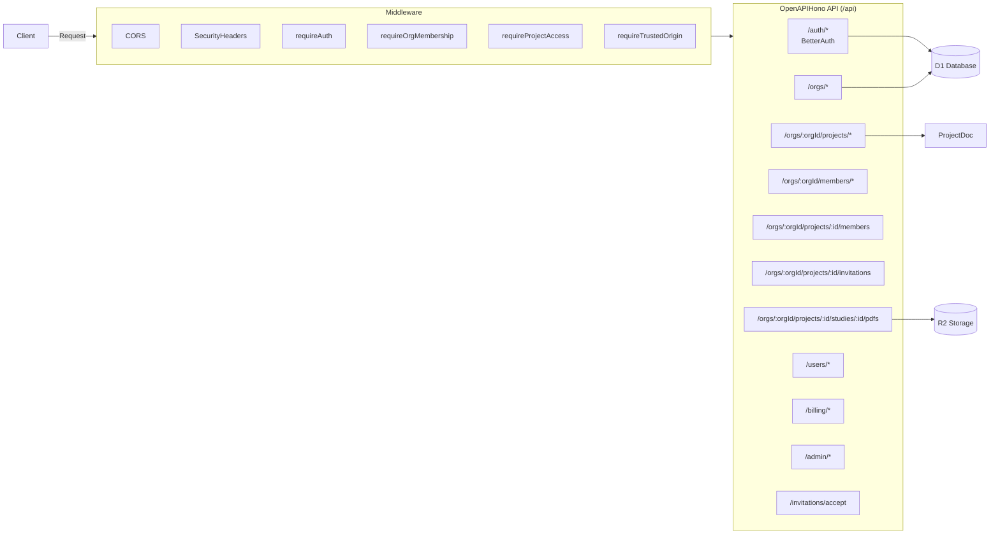

# API Routes Overview

Backend API structure with organization-scoped routes and middleware.



## Middleware Stack

| Middleware             | Purpose                         |
| ---------------------- | ------------------------------- |
| `CORS`                 | Cross-origin request handling   |
| `securityHeaders`      | Security headers (CSP, etc.)    |
| `requireAuth`          | Session validation              |
| `requireOrgMembership` | Org membership + role check     |
| `requireProjectAccess` | Project membership + role check |
| `requireTrustedOrigin` | CSRF protection                 |

## API Endpoints

### Authentication (`/auth/*`)

Handled by BetterAuth. Includes signin, signup, session management, and organization plugin.

### Organizations (`/api/orgs/*`)

Organization management (requires auth):

- `GET /api/orgs` - List user's organizations
- `POST /api/orgs` - Create new organization
- `GET /api/orgs/:orgId` - Get org details (requires org membership)
- `PUT /api/orgs/:orgId` - Update org (requires org admin)
- `DELETE /api/orgs/:orgId` - Delete org (requires org owner)
- `POST /api/orgs/:orgId/set-active` - Set active org

### Organization Members (`/api/orgs/:orgId/members`)

- `GET /api/orgs/:orgId/members` - List org members
- `POST /api/orgs/:orgId/members` - Add member (requires org admin)
- `PUT /api/orgs/:orgId/members/:memberId` - Update role (requires org admin)
- `DELETE /api/orgs/:orgId/members/:memberId` - Remove member (requires org admin or self)

### Projects (`/api/orgs/:orgId/projects/*`)

Project management (requires org membership):

- `GET /api/orgs/:orgId/projects` - List projects in org
- `POST /api/orgs/:orgId/projects` - Create new project
- `GET /api/orgs/:orgId/projects/:projectId` - Get project (requires project access)
- `PUT /api/orgs/:orgId/projects/:projectId` - Update project (requires member)
- `DELETE /api/orgs/:orgId/projects/:projectId` - Delete project (requires owner)

### Project Members (`/api/orgs/:orgId/projects/:projectId/members`)

- `GET /api/orgs/:orgId/projects/:projectId/members` - List project members
- `POST /api/orgs/:orgId/projects/:projectId/members` - Add member (requires owner)
- `PATCH /api/orgs/:orgId/projects/:projectId/members/:userId` - Update role
- `DELETE /api/orgs/:orgId/projects/:projectId/members/:userId` - Remove member

### Project Invitations (`/api/orgs/:orgId/projects/:projectId/invitations`)

- `GET /api/orgs/:orgId/projects/:projectId/invitations` - List invitations
- `POST /api/orgs/:orgId/projects/:projectId/invitations` - Create invitation (requires owner)
- `DELETE /api/orgs/:orgId/projects/:projectId/invitations/:id` - Cancel invitation

### Invitation Acceptance (`/api/invitations/accept`)

- `POST /api/invitations/accept` - Accept invitation by token (ensures org + project membership)

### PDFs (`/api/orgs/:orgId/projects/:projectId/studies/:studyId/pdfs`)

- `GET /api/orgs/:orgId/projects/:projectId/studies/:studyId/pdfs` - List PDFs
- `POST /api/orgs/:orgId/projects/:projectId/studies/:studyId/pdfs` - Upload PDF to R2
- `GET /api/orgs/:orgId/projects/:projectId/studies/:studyId/pdfs/:fileName` - Download PDF
- `DELETE /api/orgs/:orgId/projects/:projectId/studies/:studyId/pdfs/:fileName` - Remove PDF

### PDF Proxy (`/api/pdf-proxy`)

- `POST /api/pdf-proxy` - Proxy external PDF URLs to avoid CORS issues

### Users (`/api/users/*`)

- `GET /api/users/search` - Search users
- `GET /api/users/avatar` - Get user avatar
- `POST /api/users/avatar` - Upload user avatar

### Account Merge (`/api/accounts/merge`)

- `POST /api/accounts/merge` - Merge two user accounts

### Billing (`/api/billing/*`)

Stripe integration for subscriptions and payments:

- `GET /api/billing/subscription` - Get user subscription
- `POST /api/billing/checkout` - Create Stripe checkout session
- `POST /api/billing/portal` - Create Stripe customer portal session
- `POST /api/billing/webhooks` - Stripe webhook handler

### Admin (`/api/admin/*`)

Admin-only endpoints for user management and system stats.

### Google Drive (`/api/google-drive`)

Google Drive integration endpoints for importing documents.

### Durable Object Routes

These routes connect to Durable Objects directly:

- `/api/project/:projectId` - ProjectDoc WebSocket connection for Yjs sync
- `/api/sessions/:sessionId` - UserSession WebSocket connection

## Middleware Chain Order

For org-scoped routes:

```
requireAuth -> requireOrgMembership(minRole) -> requireProjectAccess(minRole) -> handler
```

See the [Organizations Guide](/guides/organizations) for middleware usage patterns.
