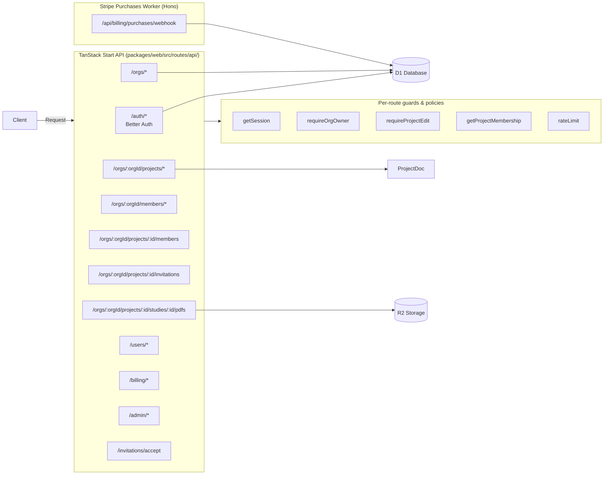

# API Routes Overview

Backend API structure. All `/api/*` routes are TanStack Start file-based server routes under `packages/web/src/routes/api/`. The Stripe purchases webhook is a separate Hono-based worker (`packages/stripe-purchases`).


```mermaid
flowchart LR
    subgraph API["TanStack Start API (packages/web/src/routes/api/)"]
        direction TB
        auth["/auth/*<br/>Better Auth"]
        orgs["/orgs/*"]
        orgprojects["/orgs/:orgId/projects/*"]
        orgmembers["/orgs/:orgId/members/*"]
        projectmembers["/orgs/:orgId/projects/:id/members"]
        invitations["/orgs/:orgId/projects/:id/invitations"]
        pdfs["/orgs/:orgId/projects/:id/studies/:id/pdfs"]
        users["/users/*"]
        billing["/billing/*"]
        admin["/admin/*"]
        inviteaccept["/invitations/accept"]
    end

    subgraph StripeWorker["Stripe Purchases Worker (Hono)"]
        purchasewebhook["/api/billing/purchases/webhook"]
    end

    subgraph GuardsPolicies["Per-route guards & policies"]
        getSession
        requireOrgOwner
        requireProjectEdit
        getProjectMembership
        rateLimit
    end

    Client -->|"Request"| API
    API --> GuardsPolicies

    orgprojects --> ProjectDoc
    pdfs --> R2[(R2 Storage)]
    auth --> D1[(D1 Database)]
    orgs --> D1
    purchasewebhook --> D1
```

## Authz building blocks

Each handler composes checks explicitly -- there is no single middleware pipeline. Common ingredients:

| Helper                   | From                                   | Purpose                          |
| ------------------------ | -------------------------------------- | -------------------------------- |
| `getSession`             | `@corates/workers/auth`                | Resolves the Better Auth session |
| `requireOrgOwner`        | `@corates/workers/policies`            | Enforces org owner role          |
| `requireProjectEdit`     | `@corates/workers/policies`            | Enforces project edit permission |
| `getProjectMembership`   | `@corates/workers/policies`            | Looks up project role            |
| `requireMemberRemoval` / `requireSafeRoleChange` | `@corates/workers/policies` | Member management safety |
| `checkRateLimit`         | `@/server/rateLimit`                   | Per-endpoint rate limits         |
| `resolveOrgAccess`       | `@corates/workers/billing-resolver`    | Plan-aware org access check      |

## API Endpoints

### Authentication (`/auth/*`)

Handled by BetterAuth. Includes signin, signup, session management, and organization plugin.

### Organizations (`/api/orgs/*`)

Organization management (requires auth):

- `GET /api/orgs` - List user's organizations
- `POST /api/orgs` - Create new organization
- `GET /api/orgs/:orgId` - Get org details (requires org membership)
- `PUT /api/orgs/:orgId` - Update org (requires org admin)
- `DELETE /api/orgs/:orgId` - Delete org (requires org owner)
- `POST /api/orgs/:orgId/set-active` - Set active org

### Organization Members (`/api/orgs/:orgId/members`)

- `GET /api/orgs/:orgId/members` - List org members
- `POST /api/orgs/:orgId/members` - Add member (requires org admin)
- `PUT /api/orgs/:orgId/members/:memberId` - Update role (requires org admin)
- `DELETE /api/orgs/:orgId/members/:memberId` - Remove member (requires org admin or self)

### Projects (`/api/orgs/:orgId/projects/*`)

Project management (requires org membership):

- `GET /api/orgs/:orgId/projects` - List projects in org
- `POST /api/orgs/:orgId/projects` - Create new project
- `GET /api/orgs/:orgId/projects/:projectId` - Get project (requires project access)
- `PUT /api/orgs/:orgId/projects/:projectId` - Update project (requires member)
- `DELETE /api/orgs/:orgId/projects/:projectId` - Delete project (requires owner)

### Project Members (`/api/orgs/:orgId/projects/:projectId/members`)

- `GET /api/orgs/:orgId/projects/:projectId/members` - List project members
- `POST /api/orgs/:orgId/projects/:projectId/members` - Add member (requires owner)
- `PATCH /api/orgs/:orgId/projects/:projectId/members/:userId` - Update role
- `DELETE /api/orgs/:orgId/projects/:projectId/members/:userId` - Remove member

### Project Invitations (`/api/orgs/:orgId/projects/:projectId/invitations`)

- `GET /api/orgs/:orgId/projects/:projectId/invitations` - List invitations
- `POST /api/orgs/:orgId/projects/:projectId/invitations` - Create invitation (requires owner)
- `DELETE /api/orgs/:orgId/projects/:projectId/invitations/:id` - Cancel invitation

### Invitation Acceptance (`/api/invitations/accept`)

- `POST /api/invitations/accept` - Accept invitation by token (ensures org + project membership)

### PDFs (`/api/orgs/:orgId/projects/:projectId/studies/:studyId/pdfs`)

- `GET /api/orgs/:orgId/projects/:projectId/studies/:studyId/pdfs` - List PDFs
- `POST /api/orgs/:orgId/projects/:projectId/studies/:studyId/pdfs` - Upload PDF to R2
- `GET /api/orgs/:orgId/projects/:projectId/studies/:studyId/pdfs/:fileName` - Download PDF
- `DELETE /api/orgs/:orgId/projects/:projectId/studies/:studyId/pdfs/:fileName` - Remove PDF

### PDF Proxy (`/api/pdf-proxy`)

- `POST /api/pdf-proxy` - Proxy external PDF URLs to avoid CORS issues

### Users (`/api/users/*`)

- `GET /api/users/search` - Search users
- `GET /api/users/avatar` - Get user avatar
- `POST /api/users/avatar` - Upload user avatar

### Account Merge (`/api/accounts/merge`)

- `POST /api/accounts/merge` - Merge two user accounts

### Billing (`/api/billing/*`)

Stripe integration for subscriptions and payments (main app Worker):

- `GET /api/billing/subscription` - Get org subscription
- `POST /api/billing/checkout` - Create Stripe checkout session
- `POST /api/billing/portal` - Create Stripe customer portal session

One-time purchase webhooks are handled by the isolated `packages/stripe-purchases` Worker at `POST /api/billing/purchases/webhook`. That Worker uses Hono and is deployed separately for isolation.

### Admin (`/api/admin/*`)

Admin-only endpoints for user management and system stats.

### Google Drive (`/api/google-drive`)

Google Drive integration endpoints for importing documents.

### Durable Object Routes

These routes connect to Durable Objects directly:

- `/api/project/:projectId` - ProjectDoc WebSocket connection for Yjs sync
- `/api/sessions/:sessionId` - UserSession WebSocket connection

## Typical handler ordering

For an org-scoped route in a TanStack Start handler:

```ts
const limit = checkRateLimit(request, env, LIMIT);
if (limit.blocked) return limit.blocked;

const session = await getSession(request, env);
if (!session) return Response.json(createDomainError(AUTH_ERRORS.REQUIRED), { status: 401 });

await requireProjectEdit(db, session.user.id, projectId);
// ... handler work ...
```

See the [Organizations Guide](/guides/organizations) for patterns.
