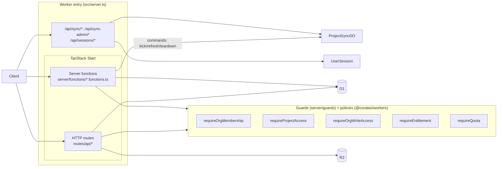

# Server API Overview

The browser reaches the server through two front doors, both served by the one Cloudflare Worker:

- **Server functions** (`packages/web/src/server/functions/*.functions.ts`) are the default. The client calls them as async functions, and TanStack Start handles the transport.
- **HTTP routes** (`packages/web/src/routes/api/`) are used only where raw HTTP is needed: the Better Auth handler, the Stripe webhook, binary file streams, browser log intake, and e2e test seams.

The worker entry (`src/server.ts`) handles the Durable Object routes before either of them, because WebSocket upgrades cannot pass through TanStack Start.

See the [API Development Guide](/guides/api-development) for how to write each.


```mermaid
flowchart LR
    Client

    subgraph Worker["Worker entry (src/server.ts)"]
        direction TB
        doroutes["/api/sync/*, /api/sync-admin/*<br/>/api/sessions/*"]
        subgraph Start["TanStack Start"]
            fns["Server functions<br/>server/functions/*.functions.ts"]
            routes["HTTP routes<br/>routes/api/*"]
        end
    end

    subgraph Guards["Guards (server/guards) + policies (@corates/workers)"]
        requireOrgMembership
        requireProjectAccess
        requireOrgWriteAccess
        requireEntitlement
        requireQuota
    end

    Client --> doroutes
    Client --> fns
    Client --> routes
    fns --> Guards
    routes --> Guards
    doroutes --> ProjectSyncDO
    doroutes --> UserSession
    fns -->|"commands: kick/refresh/teardown"| ProjectSyncDO
    fns --> D1[(D1)]
    routes --> R2[(R2)]
    routes --> D1
```

## Server functions

| File                                            | Functions                                                                                                                                                                    |
| ----------------------------------------------- | ---------------------------------------------------------------------------------------------------------------------------------------------------------------------------- |
| `workspaces.functions.ts`                       | `getMyWorkspaces`, `updateWorkspace`, `getWorkspaceMembers`, `removeWorkspaceMember`                                                                                         |
| `org-projects.functions.ts`                     | `createProject`, `updateProject`, `updateProjectSetupStep`, `deleteProject`, `getProjectMembers`, `addMemberToProject`, `removeMember`, `getInvitations`, `cancelInvitation` |
| `invitations.functions.ts`                      | `getInvitation`, `acceptInvitation`, `listMyPendingInvitations`, `declineInvitation`                                                                                         |
| `billing.functions.ts`                          | `getSubscription`, `getUsage`, `getInvoices`, `checkPlanChange`, `checkoutSubscription`, `openBillingPortal`, `syncAfterSuccess`                                             |
| `users.functions.ts`                            | `getMyProjects`, `searchUsers`, `dismissHint`, `deleteMyAccount`                                                                                                             |
| `notifications.functions.ts`                    | `listNotifications`, `getUnreadNotificationCount`, `markNotificationsRead`, `markAllNotificationsRead`, `dismissNotification`                                                |
| `account-merge.functions.ts`                    | `initiateAccountMerge`, `verifyAccountMergeCode`, `completeAccountMerge`, `cancelAccountMerge`                                                                               |
| `google-drive.functions.ts`                     | `getDriveStatus`, `disconnectDrive`, `getDrivePickerToken`, `importFromDrive`                                                                                                |
| `pdf-proxy.functions.ts`                        | `proxyPdfFetch`, which fetches an external PDF URL server-side to avoid CORS                                                                                                 |
| `contact.functions.ts`, `feedback.functions.ts` | `submitContactForm`, `submitFeedback`                                                                                                                                        |
| `dev-tools.functions.ts`                        | `exportState`, `importState`, `resetState` (dev panel only)                                                                                                                  |
| `admin-*.functions.ts`                          | Admin-only actions: users (including impersonation), workspaces and grants, projects, billing, Stripe tools, storage, database, stats, announcements                         |

**Authorization:**

- Every function runs behind `authMiddleware` except two public ones: `submitContactForm` and `getInvitation`. `getInvitation` uses `optionalAuthMiddleware` to tell the invite page who is viewing.
- Workspace-scoped functions take `orgId` as input and check it with `requireOrgMembership`. Nothing reads the session's active organization.

## HTTP routes

| Route                                                                  | Methods     | Purpose                                                                                           |
| ---------------------------------------------------------------------- | ----------- | ------------------------------------------------------------------------------------------------- |
| `/api/auth/*`                                                          | all         | Better Auth (sign-in, OAuth, sessions, 2FA, admin plugin). `/api/auth/organization/*` returns 404 |
| `/api/auth/session`                                                    | GET         | Session read for the client                                                                       |
| `/api/auth/verify-email`                                               | GET         | Email verification link                                                                           |
| `/api/auth/stripe/webhook`                                             | POST        | Stripe webhook                                                                                    |
| `/api/client-logs`                                                     | POST        | Browser log intake                                                                                |
| `/api/users/avatar`                                                    | POST        | Avatar upload                                                                                     |
| `/api/users/avatar/:userId`                                            | GET         | Avatar stream                                                                                     |
| `/api/orgs/:orgId/projects/:projectId/studies/:studyId/pdfs`           | GET, POST   | List PDFs, upload to R2                                                                           |
| `/api/orgs/:orgId/projects/:projectId/studies/:studyId/pdfs/:fileName` | GET, DELETE | Stream, delete a PDF                                                                              |
| `/api/test/*`                                                          | various     | e2e seams (seed, session, cleanup, auth-code, reset, and others)                                  |
| `/api/*` (anything else)                                               | all         | JSON `SYSTEM_ROUTE_NOT_FOUND`                                                                     |

## Durable Object routes

These are handled in the worker entry, ahead of TanStack Start:

- `/api/sync/:projectId`: the project sync WebSocket (ProjectSyncDO), authorized against D1 on connect.
- `/api/sync-admin/:projectId/:op`: the sync admin surface (export, import, stats, reset), gated by a bearer token.
- `/api/sessions/:userId`: the UserSession WebSocket for notifications.

## Authz building blocks

| Helper                                                                  | From                                | Purpose                                                    |
| ----------------------------------------------------------------------- | ----------------------------------- | ---------------------------------------------------------- |
| `authMiddleware`                                                        | `@/server/middleware/auth`          | Requires a session; puts `session` and `db` on the context |
| `requireOrgMembership(session, db, orgId, minRole?)`                    | `@/server/guards`                   | Workspace member, optionally owner                         |
| `requireProjectAccess(session, db, orgId, projectId, minRole?)`         | `@/server/guards`                   | Project member, optionally owner                           |
| `requireOrgWriteAccess`                                                 | `@/server/guards`                   | Billing-aware write gate (read-only plans)                 |
| `requireEntitlement`, `requireQuota`                                    | `@/server/guards`                   | Plan entitlement and quota checks                          |
| `requireProjectEdit`, `getProjectMembership`                            | `@corates/workers/policies`         | Project role lookups                                       |
| `requireMemberRemoval` / `requireSafeRemoval` / `requireSafeRoleChange` | `@corates/workers/policies`         | Member management safety                                   |
| `resolveOrgAccess`                                                      | `@corates/workers/billing-resolver` | Effective plan, quotas and access mode                     |

Guards return `{ ok: true; context } | { ok: false; error }`. Server functions `throw result.error`; HTTP routes `return result.error.toResponse()`.

## Typical ordering

Checks run from the outside in:

1. session
2. workspace
3. write access
4. project
5. entitlement
6. quota
7. the work itself

```ts
export async function addProjectMember(session: Session, db: Database, orgId: OrgId, projectId: ProjectId /* ... */) {
  const orgMembership = await requireOrgMembership(session, db, orgId);
  if (!orgMembership.ok) throw orgMembership.error;

  const writeAccess = await requireOrgWriteAccess('POST', db, orgId);
  if (!writeAccess.ok) throw writeAccess.error;

  const access = await requireProjectAccess(session, db, orgId, projectId, 'owner');
  if (!access.ok) throw access.error;

  const quota = await requireQuota(db, orgId, 'collaborators.org.max', () => countCollaboratorSeats(db, orgId));
  if (!quota.ok) throw quota.error;
  // ... handler work ...
}
```

See the [Organizations Guide](/guides/organizations) for the workspace and project functions.
