# API Actions and Failure Points

Comprehensive diagrams showing all actions that can be performed on projects, studies, and checklists, including all failure points and error conditions.

## Overview

This document visualizes the complete API surface for the three main entities in CoRATES:

- **Projects**: Backend API routes + Y.js sync operations
- **Studies**: Y.js operations + PDF management via backend API
- **Checklists**: Y.js operations only

Each diagram shows:

- All CRUD operations
- Permission and validation checks
- External dependencies (D1, R2, Durable Objects)
- All failure points with error codes
- Network and sync failures

---

## Project Actions

Projects are managed through both HTTP API endpoints and Y.js synchronization. The backend API handles CRUD operations and member management, while Y.js syncs metadata and member changes to Durable Objects.

```mermaid
flowchart TB
    Start([User Action]) --> Auth{Authenticated?}
    Auth -->|No| AuthError[AUTH_REQUIRED<br/>401]
    Auth -->|Yes| Action{Action Type}

    Action -->|Create| CreateFlow
    Action -->|Read| ReadFlow
    Action -->|Update| UpdateFlow
    Action -->|Delete| DeleteFlow
    Action -->|Member| MemberFlow

    subgraph CreateFlow["Create Project"]
        CreateStart[POST /api/projects] --> Entitlement{Has project.create<br/>entitlement?}
        Entitlement -->|No| EntitlementError[AUTH_FORBIDDEN<br/>403<br/>missing_entitlement]
        Entitlement -->|Yes| QuotaCheck{Under projects.max<br/>quota?}
        QuotaCheck -->|No| QuotaError[AUTH_FORBIDDEN<br/>403<br/>quota_exceeded]
        QuotaCheck -->|Yes| ValidateInput{Valid name &<br/>description?}
        ValidateInput -->|No| ValidationError[VALIDATION_ERRORS<br/>400]
        ValidateInput -->|Yes| CreateDB[Insert into D1<br/>projects + projectMembers]
        CreateDB -->|DB Error| DBError[SYSTEM_DB_TRANSACTION_FAILED<br/>500]
        CreateDB -->|Success| SyncDO[Sync to Durable Object<br/>meta + members]
        SyncDO -->|Sync Failed| SyncError[Log error<br/>Continue]
        SyncDO -->|Success| CreateSuccess[201 Created<br/>Return project]
    end

    subgraph ReadFlow["Read Project"]
        ReadStart[GET /api/projects/:id] --> CheckMembership{User is<br/>member?}
        CheckMembership -->|No| NotFoundError[PROJECT_NOT_FOUND<br/>404]
        CheckMembership -->|Yes| QueryDB[Query D1<br/>projects + projectMembers]
        QueryDB -->|DB Error| ReadDBError[SYSTEM_DB_ERROR<br/>500]
        QueryDB -->|Success| ReadSuccess[200 OK<br/>Return project]
    end

    subgraph UpdateFlow["Update Project"]
        UpdateStart[PUT /api/projects/:id] --> ValidateUpdate{Valid name &<br/>description?}
        ValidateUpdate -->|No| UpdateValidationError[VALIDATION_ERRORS<br/>400]
        ValidateUpdate -->|Yes| CheckEditRole{User has edit<br/>role? owner/collaborator}
        CheckEditRole -->|No| UpdateForbidden[AUTH_FORBIDDEN<br/>403<br/>Only owners and collaborators]
        CheckEditRole -->|Yes| UpdateDB[Update D1 projects]
        UpdateDB -->|DB Error| UpdateDBError[SYSTEM_DB_ERROR<br/>500]
        UpdateDB -->|Success| UpdateSyncDO[Sync meta to DO]
        UpdateSyncDO -->|Sync Failed| UpdateSyncError[Log error<br/>Continue]
        UpdateSyncDO -->|Success| UpdateSuccess[200 OK<br/>Success response]
    end

    subgraph DeleteFlow["Delete Project"]
        DeleteStart[DELETE /api/projects/:id] --> CheckOwner{User is<br/>owner?}
        CheckOwner -->|No| DeleteForbidden[AUTH_FORBIDDEN<br/>403<br/>Only owners can delete]
        CheckOwner -->|Yes| GetMembers[Get all members<br/>for notifications]
        GetMembers -->|DB Error| DeleteDBError1[SYSTEM_DB_ERROR<br/>500]
        GetMembers -->|Success| DisconnectDO[Disconnect all users<br/>from ProjectDoc DO]
        DisconnectDO -->|Failed| DisconnectError[Log error<br/>Continue]
        DisconnectDO -->|Success| CleanupR2[Delete all PDFs<br/>from R2 storage]
        CleanupR2 -->|Failed| R2Error[Log error<br/>Continue]
        CleanupR2 -->|Success| DeleteDB[Delete from D1<br/>projects cascade]
        DeleteDB -->|DB Error| DeleteDBError2[SYSTEM_DB_ERROR<br/>500]
        DeleteDB -->|Success| NotifyMembers[Send notifications<br/>to all members]
        NotifyMembers -->|Some Failed| NotifyError[Log errors<br/>Continue]
        NotifyMembers -->|Success| DeleteSuccess[200 OK<br/>Success response]
    end

    subgraph MemberFlow["Member Management"]
        MemberAction{Member Action}
        MemberAction -->|List| ListMembers[GET /api/projects/:id/members]
        MemberAction -->|Add| AddMemberFlow
        MemberAction -->|Update Role| UpdateRoleFlow
        MemberAction -->|Remove| RemoveMemberFlow

        ListMembers --> ListDB[Query D1<br/>projectMembers + user]
        ListDB -->|DB Error| ListDBError[SYSTEM_DB_ERROR<br/>500]
        ListDB -->|Success| ListSuccess[200 OK<br/>Return members]

        subgraph AddMemberFlow["Add Member"]
            AddStart[POST /api/projects/:id/members] --> CheckOwnerAdd{User is<br/>owner?}
            CheckOwnerAdd -->|No| AddForbidden[AUTH_FORBIDDEN<br/>403<br/>Only owners can add]
            CheckOwnerAdd -->|Yes| ValidateMember{Valid userId<br/>or email?}
            ValidateMember -->|No| MemberValidationError[VALIDATION_ERRORS<br/>400]
            ValidateMember -->|Yes| FindUser[Find user by<br/>userId or email]
            FindUser -->|Not Found| UserNotFound[USER_NOT_FOUND<br/>404]
            FindUser -->|Found| CheckExisting{Already<br/>member?}
            CheckExisting -->|Yes| MemberExists[PROJECT_MEMBER_ALREADY_EXISTS<br/>409]
            CheckExisting -->|No| InsertMember[Insert into D1<br/>projectMembers]
            InsertMember -->|DB Error| AddDBError[SYSTEM_DB_ERROR<br/>500]
            InsertMember -->|Success| NotifyUser[Send notification<br/>via UserSession DO]
            NotifyUser -->|Failed| NotifyUserError[Log error<br/>Continue]
            NotifyUser -->|Success| SyncMemberDO[Sync member to DO]
            SyncMemberDO -->|Failed| SyncMemberError[Log error<br/>Continue]
            SyncMemberDO -->|Success| AddSuccess[201 Created<br/>Return member]
        end

        subgraph UpdateRoleFlow["Update Member Role"]
            UpdateRoleStart[PUT /api/projects/:id/members/:userId] --> CheckOwnerRole{User is<br/>owner?}
            CheckOwnerRole -->|No| UpdateRoleForbidden[AUTH_FORBIDDEN<br/>403<br/>Only owners can update]
            CheckOwnerRole -->|Yes| ValidateRole{Valid role?}
            ValidateRole -->|No| RoleValidationError[VALIDATION_ERRORS<br/>400]
            ValidateRole -->|Yes| CheckLastOwner{Removing last<br/>owner?}
            CheckLastOwner -->|Yes| LastOwnerError[PROJECT_LAST_OWNER<br/>400<br/>Assign another owner first]
            CheckLastOwner -->|No| UpdateRoleDB[Update D1<br/>projectMembers.role]
            UpdateRoleDB -->|DB Error| UpdateRoleDBError[SYSTEM_DB_ERROR<br/>500]
            UpdateRoleDB -->|Success| SyncRoleDO[Sync role to DO]
            SyncRoleDO -->|Failed| SyncRoleError[Log error<br/>Continue]
            SyncRoleDO -->|Success| UpdateRoleSuccess[200 OK<br/>Success response]
        end

        subgraph RemoveMemberFlow["Remove Member"]
            RemoveStart[DELETE /api/projects/:id/members/:userId] --> CheckRemoveAuth{User is owner<br/>or self-removal?}
            CheckRemoveAuth -->|No| RemoveForbidden[AUTH_FORBIDDEN<br/>403<br/>Only owners can remove]
            CheckRemoveAuth -->|Yes| CheckTargetExists{Target member<br/>exists?}
            CheckTargetExists -->|No| RemoveNotFound[PROJECT_NOT_FOUND<br/>404<br/>Member not found]
            CheckTargetExists -->|Yes| CheckRemoveLastOwner{Removing last<br/>owner?}
            CheckRemoveLastOwner -->|Yes| RemoveLastOwnerError[PROJECT_LAST_OWNER<br/>400<br/>Assign another owner first]
            CheckRemoveLastOwner -->|No| RemoveDB[Delete from D1<br/>projectMembers]
            RemoveDB -->|DB Error| RemoveDBError[SYSTEM_DB_ERROR<br/>500]
            RemoveDB -->|Success| SyncRemoveDO[Sync removal to DO<br/>forces disconnect]
            SyncRemoveDO -->|Failed| SyncRemoveError[Log error<br/>Continue]
            SyncRemoveDO -->|Success| NotifyRemoved{Self-removal?}
            NotifyRemoved -->|Yes| RemoveSuccess[200 OK<br/>Success response]
            NotifyRemoved -->|No| NotifyRemovedUser[Send notification<br/>via UserSession DO]
            NotifyRemovedUser -->|Failed| NotifyRemovedError[Log error<br/>Continue]
            NotifyRemovedUser -->|Success| RemoveSuccess
        end
    end

    style AuthError fill:#dc3545,stroke:#991f2e,stroke-width:2px,color:#ffffff
    style EntitlementError fill:#dc3545,stroke:#991f2e,stroke-width:2px,color:#ffffff
    style QuotaError fill:#dc3545,stroke:#991f2e,stroke-width:2px,color:#ffffff
    style ValidationError fill:#dc3545,stroke:#991f2e,stroke-width:2px,color:#ffffff
    style DBError fill:#dc3545,stroke:#991f2e,stroke-width:2px,color:#ffffff
    style SyncError fill:#dc3545,stroke:#991f2e,stroke-width:2px,color:#ffffff
    style NotFoundError fill:#dc3545,stroke:#991f2e,stroke-width:2px,color:#ffffff
    style ReadDBError fill:#dc3545,stroke:#991f2e,stroke-width:2px,color:#ffffff
    style UpdateValidationError fill:#dc3545,stroke:#991f2e,stroke-width:2px,color:#ffffff
    style UpdateForbidden fill:#dc3545,stroke:#991f2e,stroke-width:2px,color:#ffffff
    style UpdateDBError fill:#dc3545,stroke:#991f2e,stroke-width:2px,color:#ffffff
    style UpdateSyncError fill:#dc3545,stroke:#991f2e,stroke-width:2px,color:#ffffff
    style DeleteForbidden fill:#dc3545,stroke:#991f2e,stroke-width:2px,color:#ffffff
    style DeleteDBError1 fill:#dc3545,stroke:#991f2e,stroke-width:2px,color:#ffffff
    style DeleteDBError2 fill:#dc3545,stroke:#991f2e,stroke-width:2px,color:#ffffff
    style DisconnectError fill:#dc3545,stroke:#991f2e,stroke-width:2px,color:#ffffff
    style R2Error fill:#dc3545,stroke:#991f2e,stroke-width:2px,color:#ffffff
    style NotifyError fill:#dc3545,stroke:#991f2e,stroke-width:2px,color:#ffffff
    style AddForbidden fill:#dc3545,stroke:#991f2e,stroke-width:2px,color:#ffffff
    style MemberValidationError fill:#dc3545,stroke:#991f2e,stroke-width:2px,color:#ffffff
    style UserNotFound fill:#dc3545,stroke:#991f2e,stroke-width:2px,color:#ffffff
    style MemberExists fill:#dc3545,stroke:#991f2e,stroke-width:2px,color:#ffffff
    style AddDBError fill:#dc3545,stroke:#991f2e,stroke-width:2px,color:#ffffff
    style NotifyUserError fill:#dc3545,stroke:#991f2e,stroke-width:2px,color:#ffffff
    style SyncMemberError fill:#dc3545,stroke:#991f2e,stroke-width:2px,color:#ffffff
    style UpdateRoleForbidden fill:#dc3545,stroke:#991f2e,stroke-width:2px,color:#ffffff
    style RoleValidationError fill:#dc3545,stroke:#991f2e,stroke-width:2px,color:#ffffff
    style LastOwnerError fill:#dc3545,stroke:#991f2e,stroke-width:2px,color:#ffffff
    style UpdateRoleDBError fill:#dc3545,stroke:#991f2e,stroke-width:2px,color:#ffffff
    style SyncRoleError fill:#dc3545,stroke:#991f2e,stroke-width:2px,color:#ffffff
    style RemoveForbidden fill:#dc3545,stroke:#991f2e,stroke-width:2px,color:#ffffff
    style RemoveNotFound fill:#dc3545,stroke:#991f2e,stroke-width:2px,color:#ffffff
    style RemoveLastOwnerError fill:#dc3545,stroke:#991f2e,stroke-width:2px,color:#ffffff
    style RemoveDBError fill:#dc3545,stroke:#991f2e,stroke-width:2px,color:#ffffff
    style SyncRemoveError fill:#dc3545,stroke:#991f2e,stroke-width:2px,color:#ffffff
    style NotifyRemovedError fill:#dc3545,stroke:#991f2e,stroke-width:2px,color:#ffffff
```

---

## Study Actions

Studies are managed entirely through Y.js operations (no direct backend API). PDFs are managed via backend API routes. Studies support metadata extraction, DOI lookups, and Google Drive imports.

```mermaid
flowchart TB
    Start([User Action]) --> Connected{Connected to<br/>project?}
    Connected -->|No| ConnectionError[Not connected to project<br/>Show toast error]
    Connected -->|Yes| Synced{Synced with<br/>Y.js?}
    Synced -->|No| SyncError[Y.js not synced<br/>Operation fails]
    Synced -->|Yes| StudyAction{Study Action}

    StudyAction -->|Create| CreateStudyFlow
    StudyAction -->|Update| UpdateStudyFlow
    StudyAction -->|Delete| DeleteStudyFlow
    StudyAction -->|PDF| PDFFlow
    StudyAction -->|Import| ImportFlow

    subgraph CreateStudyFlow["Create Study"]
        CreateStudy[createStudy name, description, metadata] --> CheckYDoc{Y.Doc<br/>available?}
        CheckYDoc -->|No| CreateYDocError[No Y.Doc<br/>Return null]
        CheckYDoc -->|Yes| GenerateId[Generate studyId<br/>crypto.randomUUID]
        GenerateId --> CreateYMap[Create Y.Map for study<br/>Set name, description,<br/>createdAt, updatedAt,<br/>checklists: new Y.Map]
        CreateYMap --> SetMetadata[Set optional metadata:<br/>originalTitle, firstAuthor,<br/>publicationYear, authors,<br/>journal, doi, abstract, etc.]
        SetMetadata --> AddToMap[Add to reviews Y.Map<br/>studiesMap.set studyId]
        AddToMap -->|Y.js Error| YjsError[Y.js operation failed<br/>Return null]
        AddToMap -->|Success| CreateSuccess[Return studyId]
    end

    subgraph UpdateStudyFlow["Update Study"]
        UpdateStudy[updateStudy studyId, updates] --> CheckYDocUpdate{Y.Doc<br/>available?}
        CheckYDocUpdate -->|No| UpdateYDocError[No Y.Doc<br/>Return]
        CheckYDocUpdate -->|Yes| GetStudyMap[Get study from<br/>reviews Y.Map]
        GetStudyMap -->|Not Found| StudyNotFound[Study not found<br/>Return]
        GetStudyMap -->|Found| UpdateFields[Update fields:<br/>name, description, metadata<br/>Set updatedAt]
        UpdateFields -->|Y.js Error| UpdateYjsError[Y.js operation failed<br/>Show toast error]
        UpdateFields -->|Success| UpdateSuccess[Update complete]
    end

    subgraph DeleteStudyFlow["Delete Study"]
        DeleteStudy[deleteStudy studyId] --> CheckYDocDelete{Y.Doc<br/>available?}
        CheckYDocDelete -->|No| DeleteYDocError[No Y.Doc<br/>Show toast error]
        CheckYDocDelete -->|Yes| GetStudyData[Get study data<br/>from projectStore]
        GetStudyData -->|Not Found| DeleteNotFound[Study not found<br/>Show toast error]
        GetStudyData -->|Found| GetPDFs[Get all PDFs<br/>for study]
        GetPDFs --> DeletePDFs[Delete each PDF<br/>from R2 storage]
        DeletePDFs -->|Some Failed| PDFDeleteError[Log warnings<br/>Continue]
        DeletePDFs -->|Success| ClearCache[Clear PDF cache<br/>from IndexedDB]
        ClearCache -->|Failed| CacheError[Log warning<br/>Continue]
        ClearCache -->|Success| DeleteFromYjs[Delete from<br/>reviews Y.Map]
        DeleteFromYjs -->|Y.js Error| DeleteYjsError[Y.js operation failed<br/>Show toast error]
        DeleteFromYjs -->|Success| DeleteSuccess[Study deleted]
    end

    subgraph PDFFlow["PDF Operations"]
        PDFAction{PDF Action}
        PDFAction -->|Upload| UploadPDFFlow
        PDFAction -->|Download| DownloadPDFFlow
        PDFAction -->|Delete| DeletePDFFlow
        PDFAction -->|List| ListPDFFlow

        subgraph UploadPDFFlow["Upload PDF"]
            UploadStart[POST /api/projects/:id/studies/:id/pdfs] --> CheckAuth{Authenticated?}
            CheckAuth -->|No| UploadAuthError[AUTH_REQUIRED<br/>401]
            CheckAuth -->|Yes| CheckMembership{User is<br/>member?}
            CheckMembership -->|No| UploadAccessError[PROJECT_ACCESS_DENIED<br/>403]
            CheckMembership -->|Yes| CheckRole{User role is<br/>viewer?}
            CheckRole -->|Yes| UploadForbidden[AUTH_FORBIDDEN<br/>403<br/>Insufficient permissions]
            CheckRole -->|No| CheckSize{File size<br/>check}
            CheckSize -->|Too Large| SizeError[FILE_TOO_LARGE<br/>413<br/>Exceeds limit]
            CheckSize -->|OK| ValidateFile{Valid PDF<br/>magic bytes?}
            ValidateFile -->|No| InvalidTypeError[FILE_INVALID_TYPE<br/>400<br/>Not a valid PDF]
            ValidateFile -->|Yes| ValidateFileName{Valid file<br/>name?}
            ValidateFileName -->|No| FileNameError[VALIDATION_FIELD_INVALID_FORMAT<br/>400<br/>Invalid file name]
            ValidateFileName -->|Yes| CheckDuplicate{File already<br/>exists?}
            CheckDuplicate -->|Yes| DuplicateError[FILE_ALREADY_EXISTS<br/>409]
            CheckDuplicate -->|No| UploadR2[Upload to R2<br/>PDF_BUCKET.put]
            UploadR2 -->|R2 Error| R2UploadError[FILE_UPLOAD_FAILED<br/>500]
            UploadR2 -->|Success| ExtractMetadata[Extract PDF metadata:<br/>title, DOI, etc.]
            ExtractMetadata -->|Failed| MetadataError[Log warning<br/>Continue]
            ExtractMetadata -->|Success| FetchDOIMetadata{DOI found?}
            FetchDOIMetadata -->|Yes| LookupDOI[Fetch from DOI API]
            LookupDOI -->|Network Error| DOINetworkError[Network error<br/>Log and continue]
            LookupDOI -->|Success| AddToStudy[Add PDF metadata<br/>to study via Y.js]
            FetchDOIMetadata -->|No| AddToStudy
            AddToStudy -->|Y.js Error| AddYjsError[Y.js operation failed<br/>Rollback: delete PDF]
            AddToStudy -->|Success| CachePDF[Cache PDF<br/>in IndexedDB]
            CachePDF -->|Failed| CachePDFError[Log warning<br/>Continue]
            CachePDF -->|Success| UploadSuccess[200 OK<br/>Return PDF info]
        end

        subgraph DownloadPDFFlow["Download PDF"]
            DownloadStart[GET /api/projects/:id/studies/:id/pdfs/:fileName] --> CheckAuthDownload{Authenticated?}
            CheckAuthDownload -->|No| DownloadAuthError[AUTH_REQUIRED<br/>401]
            CheckAuthDownload -->|Yes| CheckMembershipDownload{User is<br/>member?}
            CheckMembershipDownload -->|No| DownloadAccessError[PROJECT_ACCESS_DENIED<br/>403]
            CheckMembershipDownload -->|Yes| ValidateFileNameDownload{Valid file<br/>name?}
            ValidateFileNameDownload -->|No| FileNameDownloadError[VALIDATION_FIELD_INVALID_FORMAT<br/>400]
            ValidateFileNameDownload -->|Yes| GetR2[Get from R2<br/>PDF_BUCKET.get]
            GetR2 -->|Not Found| NotFoundError[FILE_NOT_FOUND<br/>404]
            GetR2 -->|R2 Error| R2DownloadError[SYSTEM_INTERNAL_ERROR<br/>500]
            GetR2 -->|Success| DownloadSuccess[200 OK<br/>Return PDF binary]
        end

        subgraph DeletePDFFlow["Delete PDF"]
            DeletePDFStart[DELETE /api/projects/:id/studies/:id/pdfs/:fileName] --> CheckAuthDelete{Authenticated?}
            CheckAuthDelete -->|No| DeleteAuthError[AUTH_REQUIRED<br/>401]
            CheckAuthDelete -->|Yes| CheckMembershipDelete{User is<br/>member?}
            CheckMembershipDelete -->|No| DeleteAccessError[PROJECT_ACCESS_DENIED<br/>403]
            CheckMembershipDelete -->|Yes| CheckRoleDelete{User role is<br/>viewer?}
            CheckRoleDelete -->|Yes| DeleteForbidden[AUTH_FORBIDDEN<br/>403<br/>Insufficient permissions]
            CheckRoleDelete -->|No| ValidateFileNameDelete{Valid file<br/>name?}
            ValidateFileNameDelete -->|No| FileNameDeleteError[VALIDATION_FIELD_INVALID_FORMAT<br/>400]
            ValidateFileNameDelete -->|Yes| DeleteR2[Delete from R2<br/>PDF_BUCKET.delete]
            DeleteR2 -->|R2 Error| R2DeleteError[SYSTEM_INTERNAL_ERROR<br/>500]
            DeleteR2 -->|Success| DeletePDFSuccess[200 OK<br/>Success response]
        end

        subgraph ListPDFFlow["List PDFs"]
            ListPDFStart[GET /api/projects/:id/studies/:id/pdfs] --> CheckAuthList{Authenticated?}
            CheckAuthList -->|No| ListAuthError[AUTH_REQUIRED<br/>401]
            CheckAuthList -->|Yes| CheckMembershipList{User is<br/>member?}
            CheckMembershipList -->|No| ListAccessError[PROJECT_ACCESS_DENIED<br/>403]
            CheckMembershipList -->|Yes| ListR2[List from R2<br/>PDF_BUCKET.list]
            ListR2 -->|R2 Error| R2ListError[SYSTEM_INTERNAL_ERROR<br/>500]
            ListR2 -->|Success| ListSuccess[200 OK<br/>Return PDF list]
        end
    end

    subgraph ImportFlow["Import Operations"]
        ImportAction{Import Type}
        ImportAction -->|Google Drive| GoogleDriveFlow
        ImportAction -->|DOI Lookup| DOIFlow
        ImportAction -->|Reference File| ReferenceFileFlow

        subgraph GoogleDriveFlow["Google Drive Import"]
            GDriveStart[importFromGoogleDrive fileId] --> CheckAuthGDrive{Authenticated?}
            CheckAuthGDrive -->|No| GDriveAuthError[AUTH_REQUIRED<br/>401]
            CheckAuthGDrive -->|Yes| FetchGDrive[Fetch file from<br/>Google Drive API]
            FetchGDrive -->|Network Error| GDriveNetworkError[Network error<br/>Show toast error]
            FetchGDrive -->|API Error| GDriveAPIError[Google Drive API error<br/>Show toast error]
            FetchGDrive -->|Success| UploadGDrive[Upload to R2<br/>via PDF upload flow]
            UploadGDrive -->|Failed| GDriveUploadError[Upload failed<br/>Show toast error]
            UploadGDrive -->|Success| ExtractGDriveMetadata[Extract metadata<br/>from PDF]
            ExtractGDriveMetadata -->|Failed| GDriveMetadataError[Log warning<br/>Continue]
            ExtractGDriveMetadata -->|Success| UpdateStudyGDrive[Update study<br/>with metadata]
            UpdateStudyGDrive -->|Y.js Error| GDriveYjsError[Y.js operation failed<br/>Show toast error]
            UpdateStudyGDrive -->|Success| GDriveSuccess[Import complete]
        end

        subgraph DOIFlow["DOI Lookup"]
            DOIStart[fetchFromDOI doi] --> ValidateDOI{Valid DOI<br/>format?}
            ValidateDOI -->|No| DOIValidationError[Invalid DOI<br/>Return null]
            ValidateDOI -->|Yes| FetchDOIAPI[Fetch from DOI<br/>API external]
            FetchDOIAPI -->|Network Error| DOINetworkError[Network error<br/>Log warning<br/>Return null]
            FetchDOIAPI -->|API Error| DOIAPIError[DOI API error<br/>Log warning<br/>Return null]
            FetchDOIAPI -->|Success| ParseDOIResponse[Parse response:<br/>firstAuthor, publicationYear,<br/>authors, journal, abstract]
            ParseDOIResponse -->|Parse Error| DOIParseError[Parse error<br/>Log warning<br/>Return null]
            ParseDOIResponse -->|Success| DOISuccess[Return metadata]
        end

        subgraph ReferenceFileFlow["Reference File Import"]
            RefFileStart[importReferences references] --> CheckConnectionRef{Connected to<br/>project?}
            CheckConnectionRef -->|No| RefConnectionError[Not connected<br/>Show toast error<br/>Return 0]
            CheckConnectionRef -->|Yes| LoopRefs[For each reference]
            LoopRefs --> CreateRefStudy[Create study from<br/>reference data]
            CreateRefStudy -->|Y.js Error| RefYjsError[Y.js operation failed<br/>Log error<br/>Continue]
            CreateRefStudy -->|Success| IncrementCount[Increment success count]
            IncrementCount --> MoreRefs{More<br/>references?}
            MoreRefs -->|Yes| LoopRefs
            MoreRefs -->|No| RefSuccess[Show toast<br/>Return count]
        end
    end

    style ConnectionError fill:#dc3545,stroke:#991f2e,stroke-width:2px,color:#ffffff
    style SyncError fill:#dc3545,stroke:#991f2e,stroke-width:2px,color:#ffffff
    style CreateYDocError fill:#dc3545,stroke:#991f2e,stroke-width:2px,color:#ffffff
    style YjsError fill:#dc3545,stroke:#991f2e,stroke-width:2px,color:#ffffff
    style UpdateYDocError fill:#dc3545,stroke:#991f2e,stroke-width:2px,color:#ffffff
    style StudyNotFound fill:#dc3545,stroke:#991f2e,stroke-width:2px,color:#ffffff
    style UpdateYjsError fill:#dc3545,stroke:#991f2e,stroke-width:2px,color:#ffffff
    style DeleteYDocError fill:#dc3545,stroke:#991f2e,stroke-width:2px,color:#ffffff
    style DeleteNotFound fill:#dc3545,stroke:#991f2e,stroke-width:2px,color:#ffffff
    style PDFDeleteError fill:#dc3545,stroke:#991f2e,stroke-width:2px,color:#ffffff
    style CacheError fill:#dc3545,stroke:#991f2e,stroke-width:2px,color:#ffffff
    style DeleteYjsError fill:#dc3545,stroke:#991f2e,stroke-width:2px,color:#ffffff
    style UploadAuthError fill:#dc3545,stroke:#991f2e,stroke-width:2px,color:#ffffff
    style UploadAccessError fill:#dc3545,stroke:#991f2e,stroke-width:2px,color:#ffffff
    style UploadForbidden fill:#dc3545,stroke:#991f2e,stroke-width:2px,color:#ffffff
    style SizeError fill:#dc3545,stroke:#991f2e,stroke-width:2px,color:#ffffff
    style InvalidTypeError fill:#dc3545,stroke:#991f2e,stroke-width:2px,color:#ffffff
    style FileNameError fill:#dc3545,stroke:#991f2e,stroke-width:2px,color:#ffffff
    style DuplicateError fill:#dc3545,stroke:#991f2e,stroke-width:2px,color:#ffffff
    style R2UploadError fill:#dc3545,stroke:#991f2e,stroke-width:2px,color:#ffffff
    style MetadataError fill:#dc3545,stroke:#991f2e,stroke-width:2px,color:#ffffff
    style DOINetworkError fill:#dc3545,stroke:#991f2e,stroke-width:2px,color:#ffffff
    style AddYjsError fill:#dc3545,stroke:#991f2e,stroke-width:2px,color:#ffffff
    style CachePDFError fill:#dc3545,stroke:#991f2e,stroke-width:2px,color:#ffffff
    style DownloadAuthError fill:#dc3545,stroke:#991f2e,stroke-width:2px,color:#ffffff
    style DownloadAccessError fill:#dc3545,stroke:#991f2e,stroke-width:2px,color:#ffffff
    style FileNameDownloadError fill:#dc3545,stroke:#991f2e,stroke-width:2px,color:#ffffff
    style NotFoundError fill:#dc3545,stroke:#991f2e,stroke-width:2px,color:#ffffff
    style R2DownloadError fill:#dc3545,stroke:#991f2e,stroke-width:2px,color:#ffffff
    style DeleteAuthError fill:#dc3545,stroke:#991f2e,stroke-width:2px,color:#ffffff
    style DeleteAccessError fill:#dc3545,stroke:#991f2e,stroke-width:2px,color:#ffffff
    style DeleteForbidden fill:#dc3545,stroke:#991f2e,stroke-width:2px,color:#ffffff
    style FileNameDeleteError fill:#dc3545,stroke:#991f2e,stroke-width:2px,color:#ffffff
    style R2DeleteError fill:#dc3545,stroke:#991f2e,stroke-width:2px,color:#ffffff
    style ListAuthError fill:#dc3545,stroke:#991f2e,stroke-width:2px,color:#ffffff
    style ListAccessError fill:#dc3545,stroke:#991f2e,stroke-width:2px,color:#ffffff
    style R2ListError fill:#dc3545,stroke:#991f2e,stroke-width:2px,color:#ffffff
    style GDriveAuthError fill:#dc3545,stroke:#991f2e,stroke-width:2px,color:#ffffff
    style GDriveNetworkError fill:#dc3545,stroke:#991f2e,stroke-width:2px,color:#ffffff
    style GDriveAPIError fill:#dc3545,stroke:#991f2e,stroke-width:2px,color:#ffffff
    style GDriveUploadError fill:#dc3545,stroke:#991f2e,stroke-width:2px,color:#ffffff
    style GDriveMetadataError fill:#dc3545,stroke:#991f2e,stroke-width:2px,color:#ffffff
    style GDriveYjsError fill:#dc3545,stroke:#991f2e,stroke-width:2px,color:#ffffff
    style DOIValidationError fill:#dc3545,stroke:#991f2e,stroke-width:2px,color:#ffffff
    style DOINetworkError fill:#dc3545,stroke:#991f2e,stroke-width:2px,color:#ffffff
    style DOIAPIError fill:#dc3545,stroke:#991f2e,stroke-width:2px,color:#ffffff
    style DOIParseError fill:#dc3545,stroke:#991f2e,stroke-width:2px,color:#ffffff
    style RefConnectionError fill:#dc3545,stroke:#991f2e,stroke-width:2px,color:#ffffff
    style RefYjsError fill:#dc3545,stroke:#991f2e,stroke-width:2px,color:#ffffff
```

---

## Checklist Actions

Checklists are managed entirely through Y.js operations (no backend API). Checklists support multiple types (AMSTAR2, ROBINS-I) with different answer structures. Answers are stored as nested Y.Maps for concurrent editing support.

```mermaid
flowchart TB
    Start([User Action]) --> Connected{Connected to<br/>project?}
    Connected -->|No| ConnectionError[Not connected to project<br/>Show toast error]
    Connected -->|Yes| Synced{Synced with<br/>Y.js?}
    Synced -->|No| SyncError[Y.js not synced<br/>Operation fails]
    Synced -->|Yes| ChecklistAction{Checklist Action}

    ChecklistAction -->|Create| CreateChecklistFlow
    ChecklistAction -->|Update| UpdateChecklistFlow
    ChecklistAction -->|Delete| DeleteChecklistFlow
    ChecklistAction -->|Update Answer| UpdateAnswerFlow
    ChecklistAction -->|Get Data| GetDataFlow
    ChecklistAction -->|Get Note| GetNoteFlow

    subgraph CreateChecklistFlow["Create Checklist"]
        CreateChecklist[createChecklist studyId, type, assigneeId] --> CheckYDoc{Y.Doc<br/>available?}
        CheckYDoc -->|No| CreateYDocError[No Y.Doc<br/>Show toast error<br/>Return false]
        CheckYDoc -->|Yes| GetStudy[Get study from<br/>reviews Y.Map]
        GetStudy -->|Not Found| StudyNotFound[Study not found<br/>Return null]
        GetStudy -->|Found| ValidateType{Valid checklist<br/>type? AMSTAR2/ROBINS-I}
        ValidateType -->|No| InvalidTypeError[Invalid checklist type<br/>Return null]
        ValidateType -->|Yes| GetChecklistsMap[Get checklists Y.Map<br/>from study]
        GetChecklistsMap -->|Not Exists| CreateChecklistsMap[Create new Y.Map<br/>for checklists]
        CreateChecklistsMap -->|Y.js Error| CreateMapError[Y.js operation failed<br/>Return null]
        CreateChecklistsMap -->|Success| GenerateChecklistId[Generate checklistId<br/>crypto.randomUUID]
        GetChecklistsMap -->|Exists| GenerateChecklistId
        GenerateChecklistId --> GetTemplate[Get checklist template<br/>from CHECKLIST_REGISTRY]
        GetTemplate -->|Type Not Found| TemplateError[Checklist type not in registry<br/>Return null]
        GetTemplate -->|Found| ExtractAnswers[Extract default answers<br/>structure from template]
        ExtractAnswers -->|Extract Error| ExtractError[Failed to extract answers<br/>Return null]
        ExtractAnswers -->|Success| CreateChecklistYMap[Create checklist Y.Map:<br/>type, title, assignedTo,<br/>status: pending,<br/>isReconciled: false,<br/>createdAt, updatedAt]
        CreateChecklistYMap --> CreateAnswersMap[Create answers Y.Map<br/>Structure depends on type]
        CreateAnswersMap -->|AMSTAR2| CreateAMSTAR2Answers[Create nested Y.Maps<br/>for each question q1-q16<br/>with answers, critical, note]
        CreateAMSTAR2Answers -->|Y.js Error| AMSTAR2Error[Y.js operation failed<br/>Return null]
        CreateAMSTAR2Answers -->|Success| AddToChecklistsMap[Add to checklists Y.Map<br/>checklistsMap.set checklistId]
        CreateAnswersMap -->|ROBINS-I| CreateROBINSAnswers[Create nested Y.Maps<br/>for domains, sections<br/>with judgement, direction,<br/>answers nested structure]
        CreateROBINSAnswers -->|Y.js Error| ROBINSError[Y.js operation failed<br/>Return null]
        CreateROBINSAnswers -->|Success| AddToChecklistsMap
        CreateAnswersMap -->|Other| CreateOtherAnswers[Store data directly<br/>as JSON]
        CreateOtherAnswers -->|Y.js Error| OtherError[Y.js operation failed<br/>Return null]
        CreateOtherAnswers -->|Success| AddToChecklistsMap
        AddToChecklistsMap -->|Y.js Error| AddMapError[Y.js operation failed<br/>Return null]
        AddToChecklistsMap -->|Success| UpdateStudyTimestamp[Update study<br/>updatedAt timestamp]
        UpdateStudyTimestamp -->|Y.js Error| TimestampError[Y.js operation failed<br/>Log error<br/>Continue]
        UpdateStudyTimestamp -->|Success| CreateSuccess[Return checklistId]
    end

    subgraph UpdateChecklistFlow["Update Checklist"]
        UpdateChecklist[updateChecklist studyId, checklistId, updates] --> CheckYDocUpdate{Y.Doc<br/>available?}
        CheckYDocUpdate -->|No| UpdateYDocError[No Y.Doc<br/>Show toast error]
        CheckYDocUpdate -->|Yes| GetStudyUpdate[Get study from<br/>reviews Y.Map]
        GetStudyUpdate -->|Not Found| UpdateStudyNotFound[Study not found<br/>Return]
        GetStudyUpdate -->|Found| GetChecklistsMapUpdate[Get checklists Y.Map]
        GetChecklistsMapUpdate -->|Not Exists| UpdateChecklistsMapError[Checklists map not found<br/>Return]
        GetChecklistsMapUpdate -->|Exists| GetChecklist[Get checklist Y.Map]
        GetChecklist -->|Not Found| UpdateChecklistNotFound[Checklist not found<br/>Return]
        GetChecklist -->|Found| UpdateFields[Update fields:<br/>title, assignedTo,<br/>status, isReconciled<br/>Set updatedAt]
        UpdateFields -->|Y.js Error| UpdateYjsError[Y.js operation failed<br/>Show toast error]
        UpdateFields -->|Success| UpdateSuccess[Update complete]
    end

    subgraph DeleteChecklistFlow["Delete Checklist"]
        DeleteChecklist[deleteChecklist studyId, checklistId] --> CheckYDocDelete{Y.Doc<br/>available?}
        CheckYDocDelete -->|No| DeleteYDocError[No Y.Doc<br/>Show toast error]
        CheckYDocDelete -->|Yes| GetStudyDelete[Get study from<br/>reviews Y.Map]
        GetStudyDelete -->|Not Found| DeleteStudyNotFound[Study not found<br/>Return]
        GetStudyDelete -->|Found| GetChecklistsMapDelete[Get checklists Y.Map]
        GetChecklistsMapDelete -->|Not Exists| DeleteChecklistsMapError[Checklists map not found<br/>Return]
        GetChecklistsMapDelete -->|Exists| DeleteFromMap[Delete from<br/>checklists Y.Map]
        DeleteFromMap -->|Y.js Error| DeleteYjsError[Y.js operation failed<br/>Show toast error]
        DeleteFromMap -->|Success| UpdateStudyTimestampDelete[Update study<br/>updatedAt timestamp]
        UpdateStudyTimestampDelete -->|Y.js Error| DeleteTimestampError[Y.js operation failed<br/>Log error<br/>Continue]
        UpdateStudyTimestampDelete -->|Success| DeleteSuccess[Checklist deleted]
    end

    subgraph UpdateAnswerFlow["Update Checklist Answer"]
        UpdateAnswer[updateChecklistAnswer studyId, checklistId, key, data] --> CheckYDocAnswer{Y.Doc<br/>available?}
        CheckYDocAnswer -->|No| AnswerYDocError[No Y.Doc<br/>Return]
        CheckYDocAnswer -->|Yes| GetStudyAnswer[Get study from<br/>reviews Y.Map]
        GetStudyAnswer -->|Not Found| AnswerStudyNotFound[Study not found<br/>Return]
        GetStudyAnswer -->|Found| GetChecklistsMapAnswer[Get checklists Y.Map]
        GetChecklistsMapAnswer -->|Not Exists| AnswerChecklistsMapError[Checklists map not found<br/>Return]
        GetChecklistsMapAnswer -->|Exists| GetChecklistAnswer[Get checklist Y.Map]
        GetChecklistAnswer -->|Not Found| AnswerChecklistNotFound[Checklist not found<br/>Return]
        GetChecklistAnswer -->|Found| GetAnswersMap[Get answers Y.Map<br/>from checklist]
        GetAnswersMap -->|Not Exists| CreateAnswersMapAnswer[Create new<br/>answers Y.Map]
        CreateAnswersMapAnswer -->|Y.js Error| CreateAnswersError[Y.js operation failed<br/>Return]
        CreateAnswersMapAnswer -->|Success| GetChecklistType[Get checklist type]
        GetAnswersMap -->|Exists| GetChecklistType
        GetChecklistType -->|AMSTAR2| UpdateAMSTAR2Answer[Update question Y.Map:<br/>answers, critical<br/>Preserve note Y.Text]
        UpdateAMSTAR2Answer -->|Y.js Error| UpdateAMSTAR2Error[Y.js operation failed<br/>Return]
        UpdateAMSTAR2Answer -->|Success| CheckStatus[Check status]
        GetChecklistType -->|ROBINS-I| UpdateROBINSAnswer[Update section Y.Map:<br/>judgement, direction,<br/>nested answers structure]
        UpdateROBINSAnswer -->|Y.js Error| UpdateROBINSError[Y.js operation failed<br/>Return]
        UpdateROBINSAnswer -->|Success| CheckStatus
        GetChecklistType -->|Other| UpdateOtherAnswer[Store data directly]
        UpdateOtherAnswer -->|Y.js Error| UpdateOtherError[Y.js operation failed<br/>Return]
        UpdateOtherAnswer -->|Success| CheckStatus
        CheckStatus -->|status === pending| SetInProgress[Set status to<br/>in-progress]
        SetInProgress -->|Y.js Error| StatusError[Y.js operation failed<br/>Log error<br/>Continue]
        SetInProgress -->|Success| SetUpdatedAt[Set updatedAt<br/>timestamp]
        CheckStatus -->|status !== pending| SetUpdatedAt
        SetUpdatedAt -->|Y.js Error| UpdatedAtError[Y.js operation failed<br/>Log error<br/>Continue]
        SetUpdatedAt -->|Success| AnswerSuccess[Answer updated]
    end

    subgraph GetDataFlow["Get Checklist Data"]
        GetData[getChecklistData studyId, checklistId] --> CheckYDocData{Y.Doc<br/>available?}
        CheckYDocData -->|No| DataYDocError[No Y.Doc<br/>Return null]
        CheckYDocData -->|Yes| GetStudyData[Get study from<br/>reviews Y.Map]
        GetStudyData -->|Not Found| DataStudyNotFound[Study not found<br/>Return null]
        GetStudyData -->|Found| GetChecklistsMapData[Get checklists Y.Map]
        GetChecklistsMapData -->|Not Exists| DataChecklistsMapError[Checklists map not found<br/>Return null]
        GetChecklistsMapData -->|Exists| GetChecklistData[Get checklist Y.Map]
        GetChecklistData -->|Not Found| DataChecklistNotFound[Checklist not found<br/>Return null]
        GetChecklistData -->|Found| ConvertToJSON[Convert Y.Map to<br/>plain object]
        ConvertToJSON -->|Conversion Error| ConvertError[Conversion failed<br/>Return null]
        ConvertToJSON -->|Success| GetAnswers[Get answers Y.Map]
        GetAnswers -->|Not Exists| DataAnswersNotFound[Answers map not found<br/>Return data without answers]
        GetAnswers -->|Exists| ReconstructAnswers[Reconstruct nested structure<br/>from Y.Maps based on type]
        ReconstructAnswers -->|AMSTAR2| ReconstructAMSTAR2[Convert question Y.Maps<br/>to plain objects]
        ReconstructAMSTAR2 -->|Error| ReconstructAMSTAR2Error[Reconstruction failed<br/>Return partial data]
        ReconstructAMSTAR2 -->|Success| MergeData[Merge with checklist data]
        ReconstructAnswers -->|ROBINS-I| ReconstructROBINS[Convert domain/section Y.Maps<br/>to nested structure]
        ReconstructROBINS -->|Error| ReconstructROBINSError[Reconstruction failed<br/>Return partial data]
        ReconstructROBINS -->|Success| MergeData
        ReconstructAnswers -->|Other| ReconstructOther[Convert directly]
        ReconstructOther -->|Error| ReconstructOtherError[Reconstruction failed<br/>Return partial data]
        ReconstructOther -->|Success| MergeData
        MergeData -->|Success| DataSuccess[Return checklist data]
    end

    subgraph GetNoteFlow["Get Question Note"]
        GetNote[getQuestionNote studyId, checklistId, questionKey] --> CheckYDocNote{Y.Doc<br/>available?}
        CheckYDocNote -->|No| NoteYDocError[No Y.Doc<br/>Return null]
        CheckYDocNote -->|Yes| GetStudyNote[Get study from<br/>reviews Y.Map]
        GetStudyNote -->|Not Found| NoteStudyNotFound[Study not found<br/>Return null]
        GetStudyNote -->|Found| GetChecklistsMapNote[Get checklists Y.Map]
        GetChecklistsMapNote -->|Not Exists| NoteChecklistsMapError[Checklists map not found<br/>Return null]
        GetChecklistsMapNote -->|Exists| GetChecklistNote[Get checklist Y.Map]
        GetChecklistNote -->|Not Found| NoteChecklistNotFound[Checklist not found<br/>Return null]
        GetChecklistNote -->|Found| GetAnswersMapNote[Get answers Y.Map]
        GetAnswersMapNote -->|Not Exists| NoteAnswersNotFound[Answers map not found<br/>Return null]
        GetAnswersMapNote -->|Exists| GetQuestionMap[Get question Y.Map<br/>by questionKey]
        GetQuestionMap -->|Not Found| NoteQuestionNotFound[Question not found<br/>Return null]
        GetQuestionMap -->|Found| GetNoteYText[Get note Y.Text]
        GetNoteYText -->|Not Exists| CreateNoteYText[Create new Y.Text<br/>for backward compatibility]
        CreateNoteYText -->|Not Synced| NoteNotSyncedError[Not synced<br/>Return null]
        CreateNoteYText -->|Synced| NoteSuccess[Return Y.Text]
        GetNoteYText -->|Exists| NoteSuccess
    end

    style ConnectionError fill:#dc3545,stroke:#991f2e,stroke-width:2px,color:#ffffff
    style SyncError fill:#dc3545,stroke:#991f2e,stroke-width:2px,color:#ffffff
    style CreateYDocError fill:#dc3545,stroke:#991f2e,stroke-width:2px,color:#ffffff
    style StudyNotFound fill:#dc3545,stroke:#991f2e,stroke-width:2px,color:#ffffff
    style InvalidTypeError fill:#dc3545,stroke:#991f2e,stroke-width:2px,color:#ffffff
    style CreateMapError fill:#dc3545,stroke:#991f2e,stroke-width:2px,color:#ffffff
    style TemplateError fill:#dc3545,stroke:#991f2e,stroke-width:2px,color:#ffffff
    style ExtractError fill:#dc3545,stroke:#991f2e,stroke-width:2px,color:#ffffff
    style AMSTAR2Error fill:#dc3545,stroke:#991f2e,stroke-width:2px,color:#ffffff
    style ROBINSError fill:#dc3545,stroke:#991f2e,stroke-width:2px,color:#ffffff
    style OtherError fill:#dc3545,stroke:#991f2e,stroke-width:2px,color:#ffffff
    style AddMapError fill:#dc3545,stroke:#991f2e,stroke-width:2px,color:#ffffff
    style TimestampError fill:#dc3545,stroke:#991f2e,stroke-width:2px,color:#ffffff
    style UpdateYDocError fill:#dc3545,stroke:#991f2e,stroke-width:2px,color:#ffffff
    style UpdateStudyNotFound fill:#dc3545,stroke:#991f2e,stroke-width:2px,color:#ffffff
    style UpdateChecklistsMapError fill:#dc3545,stroke:#991f2e,stroke-width:2px,color:#ffffff
    style UpdateChecklistNotFound fill:#dc3545,stroke:#991f2e,stroke-width:2px,color:#ffffff
    style UpdateYjsError fill:#dc3545,stroke:#991f2e,stroke-width:2px,color:#ffffff
    style DeleteYDocError fill:#dc3545,stroke:#991f2e,stroke-width:2px,color:#ffffff
    style DeleteStudyNotFound fill:#dc3545,stroke:#991f2e,stroke-width:2px,color:#ffffff
    style DeleteChecklistsMapError fill:#dc3545,stroke:#991f2e,stroke-width:2px,color:#ffffff
    style DeleteYjsError fill:#dc3545,stroke:#991f2e,stroke-width:2px,color:#ffffff
    style DeleteTimestampError fill:#dc3545,stroke:#991f2e,stroke-width:2px,color:#ffffff
    style AnswerYDocError fill:#dc3545,stroke:#991f2e,stroke-width:2px,color:#ffffff
    style AnswerStudyNotFound fill:#dc3545,stroke:#991f2e,stroke-width:2px,color:#ffffff
    style AnswerChecklistsMapError fill:#dc3545,stroke:#991f2e,stroke-width:2px,color:#ffffff
    style AnswerChecklistNotFound fill:#dc3545,stroke:#991f2e,stroke-width:2px,color:#ffffff
    style CreateAnswersError fill:#dc3545,stroke:#991f2e,stroke-width:2px,color:#ffffff
    style UpdateAMSTAR2Error fill:#dc3545,stroke:#991f2e,stroke-width:2px,color:#ffffff
    style UpdateROBINSError fill:#dc3545,stroke:#991f2e,stroke-width:2px,color:#ffffff
    style UpdateOtherError fill:#dc3545,stroke:#991f2e,stroke-width:2px,color:#ffffff
    style StatusError fill:#dc3545,stroke:#991f2e,stroke-width:2px,color:#ffffff
    style UpdatedAtError fill:#dc3545,stroke:#991f2e,stroke-width:2px,color:#ffffff
    style DataYDocError fill:#dc3545,stroke:#991f2e,stroke-width:2px,color:#ffffff
    style DataStudyNotFound fill:#dc3545,stroke:#991f2e,stroke-width:2px,color:#ffffff
    style DataChecklistsMapError fill:#dc3545,stroke:#991f2e,stroke-width:2px,color:#ffffff
    style DataChecklistNotFound fill:#dc3545,stroke:#991f2e,stroke-width:2px,color:#ffffff
    style ConvertError fill:#dc3545,stroke:#991f2e,stroke-width:2px,color:#ffffff
    style DataAnswersNotFound fill:#dc3545,stroke:#991f2e,stroke-width:2px,color:#ffffff
    style ReconstructAMSTAR2Error fill:#dc3545,stroke:#991f2e,stroke-width:2px,color:#ffffff
    style ReconstructROBINSError fill:#dc3545,stroke:#991f2e,stroke-width:2px,color:#ffffff
    style ReconstructOtherError fill:#dc3545,stroke:#991f2e,stroke-width:2px,color:#ffffff
    style NoteYDocError fill:#dc3545,stroke:#991f2e,stroke-width:2px,color:#ffffff
    style NoteStudyNotFound fill:#dc3545,stroke:#991f2e,stroke-width:2px,color:#ffffff
    style NoteChecklistsMapError fill:#dc3545,stroke:#991f2e,stroke-width:2px,color:#ffffff
    style NoteChecklistNotFound fill:#dc3545,stroke:#991f2e,stroke-width:2px,color:#ffffff
    style NoteAnswersNotFound fill:#dc3545,stroke:#991f2e,stroke-width:2px,color:#ffffff
    style NoteQuestionNotFound fill:#dc3545,stroke:#991f2e,stroke-width:2px,color:#ffffff
    style NoteNotSyncedError fill:#dc3545,stroke:#991f2e,stroke-width:2px,color:#ffffff
```

---

## Failure Points Legend

### Error Code Categories

#### Authentication Errors (AUTH_ERRORS)

- **AUTH_REQUIRED** (401): User not authenticated
- **AUTH_INVALID** (401): Invalid credentials
- **AUTH_EXPIRED** (401): Session expired
- **AUTH_FORBIDDEN** (403): Insufficient permissions or missing entitlement

#### Validation Errors (VALIDATION_ERRORS)

- **FIELD_REQUIRED** (400): Required field missing
- **FIELD_INVALID_FORMAT** (400): Field format invalid
- **FIELD_TOO_LONG** (400): Field exceeds maximum length
- **FIELD_TOO_SHORT** (400): Field below minimum length
- **MULTI_FIELD** (400): Multiple validation errors
- **FAILED** (400): General validation failure
- **INVALID_INPUT** (400): Invalid input data

#### Project Errors (PROJECT_ERRORS)

- **NOT_FOUND** (404): Project, member, or resource not found
- **ACCESS_DENIED** (403): User does not have access to project
- **MEMBER_ALREADY_EXISTS** (409): User is already a member
- **LAST_OWNER** (400): Cannot remove last owner
- **INVALID_ROLE** (400): Invalid role specified

#### File Errors (FILE_ERRORS)

- **TOO_LARGE** (413): File exceeds size limit
- **INVALID_TYPE** (400): Invalid file type (not PDF)
- **NOT_FOUND** (404): File not found in R2
- **UPLOAD_FAILED** (500): File upload to R2 failed
- **ALREADY_EXISTS** (409): File with same name already exists

#### User Errors (USER_ERRORS)

- **NOT_FOUND** (404): User not found
- **EMAIL_NOT_VERIFIED** (403): Email address not verified

#### System Errors (SYSTEM_ERRORS)

- **DB_ERROR** (500): Database operation failed
- **DB_TRANSACTION_FAILED** (500): Database transaction failed
- **EMAIL_SEND_FAILED** (500): Failed to send email
- **EMAIL_INVALID** (400): Invalid email address
- **RATE_LIMITED** (429): Too many requests
- **INTERNAL_ERROR** (500): Internal server error
- **SERVICE_UNAVAILABLE** (503): Service temporarily unavailable

### HTTP Status Codes

- **200 OK**: Successful operation
- **201 Created**: Resource created successfully
- **400 Bad Request**: Validation error or business logic error
- **401 Unauthorized**: Authentication required or invalid
- **403 Forbidden**: Insufficient permissions
- **404 Not Found**: Resource not found
- **409 Conflict**: Resource conflict (e.g., duplicate)
- **413 Payload Too Large**: File size exceeds limit
- **429 Too Many Requests**: Rate limit exceeded
- **500 Internal Server Error**: Server error
- **503 Service Unavailable**: Service temporarily unavailable

### Y.js Sync Failures

Y.js operations can fail in several ways:

- **Not Connected**: No active Y.js connection to project
- **Not Synced**: Y.js document not yet synced with server
- **Y.Doc Missing**: Y.Doc not available (null/undefined)
- **Y.js Operation Error**: Y.js map/text operation throws error
- **Sync Conflict**: Concurrent edits cause sync issues

### Network Failures

External API calls can fail:

- **Network Error**: Connection timeout, DNS failure, etc.
- **API Error**: External API returns error response
- **Parse Error**: Failed to parse API response
- **Timeout**: Request exceeded timeout limit

### Permission Levels

- **Owner**: Full access, can delete project, manage all members
- **Collaborator**: Can edit content, cannot delete project or manage members
- **Member**: Can edit content, cannot delete project or manage members
- **Viewer**: Read-only access, cannot edit or upload

### External Dependencies

- **D1 Database**: Cloudflare D1 SQL database for persistent storage
- **R2 Storage**: Cloudflare R2 object storage for PDFs
- **Durable Objects**: ProjectDoc and UserSession for real-time sync
- **External APIs**: DOI lookup, Google Drive API
