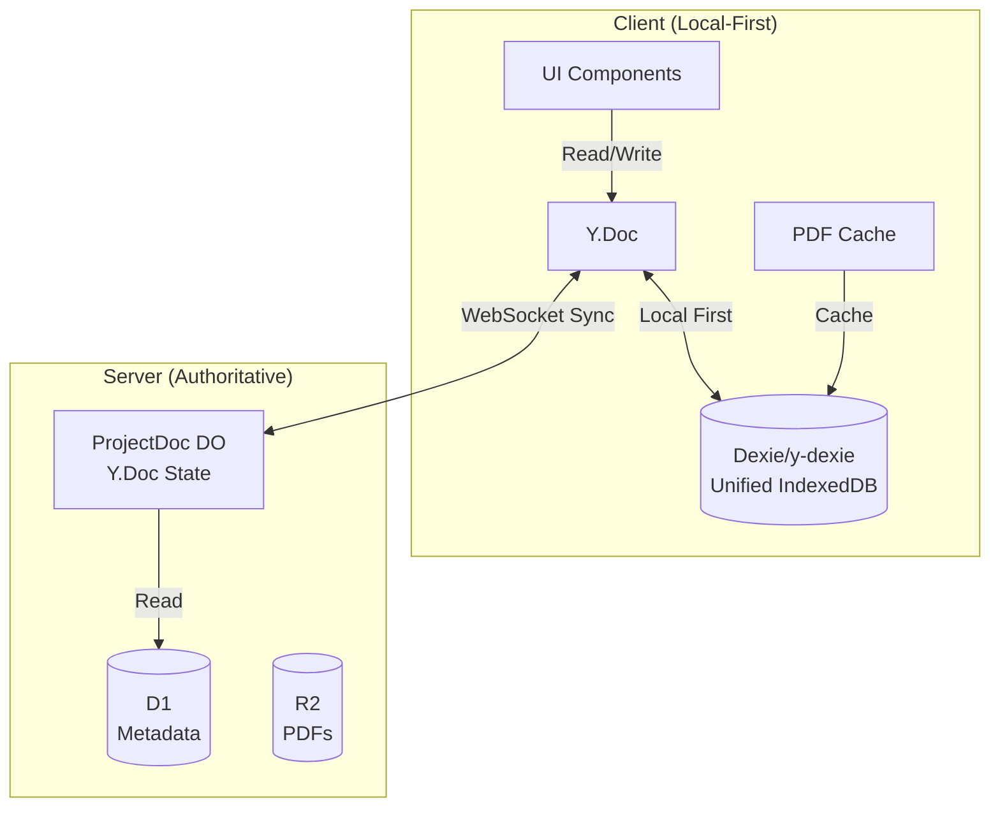

```mermaid
flowchart TB
    subgraph Client["Client (Local-First)"]
        UI[UI Components]
        YDoc[Y.Doc]
        Dexie[(Dexie/y-dexie<br/>Unified IndexedDB)]
        Cache[PDF Cache]
    end

    subgraph Server["Server (Authoritative)"]
        DO[ProjectDoc DO<br/>Y.Doc State]
        D1[(D1<br/>Metadata)]
        R2[(R2<br/>PDFs)]
    end

    YDoc <-->|"Local First"| Dexie
    YDoc <-->|"WebSocket Sync"| DO
    UI -->|"Read/Write"| YDoc
    Cache -->|"Cache"| Dexie
    DO -->|"Read"| D1
```
