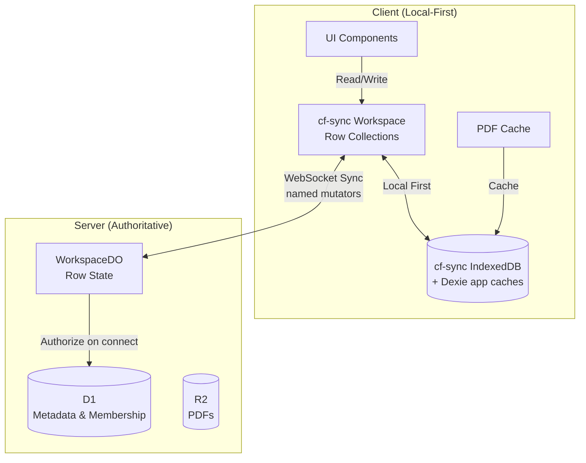

```mermaid
flowchart TB
    subgraph Client["Client (Local-First)"]
        UI[UI Components]
        Workspace[cf-sync Workspace<br/>Row Collections]
        IDB[(cf-sync IndexedDB<br/>+ Dexie app caches)]
        Cache[PDF Cache]
    end

    subgraph Server["Server (Authoritative)"]
        DO[WorkspaceDO<br/>Row State]
        D1[(D1<br/>Metadata & Membership)]
        R2[(R2<br/>PDFs)]
    end

    Workspace <-->|"Local First"| IDB
    Workspace <-->|"WebSocket Sync<br/>named mutators"| DO
    UI -->|"Read/Write"| Workspace
    Cache -->|"Cache"| IDB
    DO -->|"Authorize on connect"| D1
```
