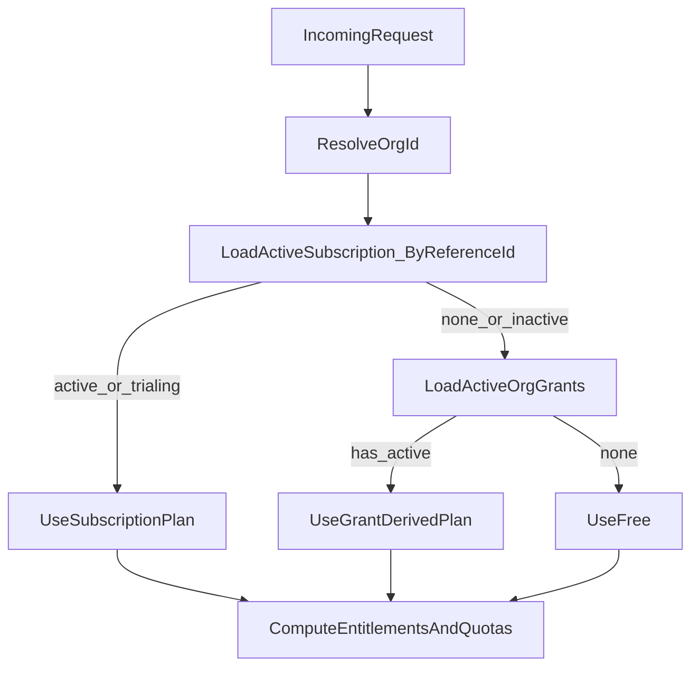

# Implement org-scoped pricing + billing (v3)

## Updated requirements (latest decisions)

- **Collaborators**: only **accepted** collaborators count (pending invites do not count).
- If collaborator limit is reached, **accepting** an invite must fail (invitation remains unaccepted).
- **Any project member must be an org member**. When adding a user to a project, we always add org membership with role **`member`** (project roles and org roles remain separate).
- **No auto-removal**: removing someone from their last project does not remove their org membership.
- **No backwards compatibility**: we can remove/replace existing user-scoped subscription plumbing without migration complexity.
- **Trial is a grant**, not a "plan".
- **Grants must be tightened**: define explicit precedence and state resolution, especially when upgrading to a subscription.
- Billing is **org-first**: Better Auth Stripe subscriptions are associated via `referenceId = orgId`. We do not build special customer-id reuse logic on our side.

## State assessment (repo)

- Orgs exist (Better Auth organization plugin) and personal org bootstrap already happens in [`packages/workers/src/auth/config.js`](packages/workers/src/auth/config.js).
- Projects are org-owned (`projects.orgId`) in [`packages/workers/src/db/schema.js`](packages/workers/src/db/schema.js).
- Project invite acceptance currently *optionally* grants org membership (`grantOrgMembership`). We will remove that optionality and enforce org membership always.

## Core architecture: BillingResolver

Add a single resolver that computes the org's **effective plan** and exposes:
- `effectivePlanId`
- `entitlements`
- `quotas`
- `source` (`subscription` | `grant` | `free`)
- relevant timestamps (e.g. `expiresAt` for grants)

**Implementation requirement**: The BillingResolver must centralize all subscription status evaluation logic (see "Stripe subscription status handling" below). This logic must not be duplicated elsewhere in the codebase.

### Effective access resolution

Formal precedence rules:

1. **Stripe subscriptions take precedence over grants**
   - If an org has an active Stripe subscription (including `trialing`), grants are ignored for entitlements/quotas (but remain stored for fallback on cancellation).
   - **Trialing + grant overlap**: When a subscription is `trialing`, it takes precedence over any active grants. Grants remain stored and become effective if the trial ends without conversion.
   - **Uniqueness requirement**: There must be at most one active (or trialing) subscription per `referenceId = orgId`. If multiple exist (should not happen), BillingResolver must treat this as an invariant violation and pick the one with the latest `periodEnd` (and log/alert).

2. **Stripe subscription status handling** (centralized in BillingResolver):
   - **Active statuses** (subscription provides full access):
     - `active`: Full access
     - `trialing`: Full access (subscription takes precedence over grants, even if grants are active)
     - `past_due`: Full access until `current_period_end` (grace period), then inactive
     - `cancel_at_period_end = true`: Full access until `current_period_end`, then inactive
   - **Inactive statuses** (subscription does not provide access):
     - `paused`: Inactive immediately (no grace period)
     - `canceled`: Inactive (check `endedAt` to confirm final end)
     - `incomplete`: Inactive
     - `incomplete_expired`: Inactive
     - `unpaid`: Inactive (no grace period)
   - **Implementation note**: This status evaluation logic must be implemented once in `BillingResolver.isSubscriptionActive()`, not duplicated across the codebase.

3. **Access grants are ignored while a Stripe subscription is active**
   - Grants are not deleted; they remain available for fallback if subscription is canceled/downgraded.

4. **Grant precedence** (when no active subscription):
   - `trial` > `single_project` (trial takes precedence if both are active).
   - A grant is active if `now >= startsAt AND now < expiresAt`.
   - **Tie-breaker**: When multiple grants of the same `type` exist, the grant with the latest `expiresAt` is used.

5. **Expired grants result in read-only access**
   - Expired grants provide read-only entitlements (see "Access states" section below for details).

6. **Default fallback**: free tier (when no active subscription and no active grants).

### Access states and transitions

#### Read-only access definition

When an org has read-only access (expired grant or ended subscription), the following applies:

**Allowed actions:**
- View existing projects and their content
- View project members and settings
- Export/download project data
- Read-only API access (GET requests)

**Blocked actions:**
- Create new projects
- Modify existing projects (edit studies, checklists, notes, etc.)
- Add or remove project members
- Upload PDFs or other files
- Modify project settings
- Write API access (POST, PUT, PATCH, DELETE requests)

#### Subscription end scenarios

1. **Subscription canceled (scheduled)**
   - `cancelAtPeriodEnd = true`: Subscription remains **fully active** until `current_period_end`.
   - After `current_period_end`: Subscription status becomes `canceled`, access transitions to read-only if no active grants exist, otherwise falls back to active grants.

2. **Subscription canceled (immediate)**
   - `cancelAtPeriodEnd = false`: Subscription status becomes `canceled` immediately.
   - Access transitions to read-only if no active grants exist, otherwise falls back to active grants.

3. **Subscription ended**
   - `status = "canceled"` with `endedAt` set: Subscription has fully ended.
   - Access transitions to read-only if no active grants exist, otherwise falls back to active grants.

4. **Subscription past_due (payment failed)**
   - `status = "past_due"`: Subscription remains **fully active** until `current_period_end` (grace period).
   - After `current_period_end` without payment: Status may transition to `unpaid` or `canceled`, access becomes read-only if no active grants exist.

5. **Subscription paused**
   - `status = "paused"`: Access is **read-only** immediately (no grace period).
   - Falls back to active grants if any exist, otherwise read-only access.

6. **Subscription unpaid**
   - `status = "unpaid"`: Access is **read-only** immediately (no grace period beyond `current_period_end`).
   - Falls back to active grants if any exist, otherwise read-only access.

#### Grant expiration scenarios

1. **Grant expires**
   - `now >= expiresAt`: Grant is expired.
   - Access becomes **read-only** (see read-only definition above).
   - If an active subscription exists, subscription takes precedence and access remains full.

2. **Grant revoked**
   - `revokedAt IS NOT NULL`: Grant is inactive immediately.
   - Access falls back to active subscription (if any) or free tier.

#### Access state priority (summary)

1. **Active subscription** (`active`, `trialing`, or `past_due` before `current_period_end`) → Full access
2. **Active grant** (not expired, not revoked) → Full access
3. **Expired grant** (no active subscription) → Read-only access
4. **No subscription, no grants** → Free tier (read-only access)

**Note**: When transitioning from full access to read-only, existing data remains accessible but cannot be modified. Users should be notified of the access state change.

## Billing model

### A) Recurring tiers (Better Auth Stripe plugin)

- Use Better Auth Stripe plugin subscription feature.
- Plans: `starter_team`, `team`, `unlimited_team` (and optionally annual discount price IDs).
- All subscription operations use `referenceId = orgId`.
- Configure `authorizeReference` to require org `owner` (membership check in `member` table).
- Use plugin webhook endpoint: `/api/auth/stripe/webhook`.
- **Customer creation**: Set `createCustomerOnSignUp: true` in the Stripe plugin config so `user.stripeCustomerId` is created at signup and reused for both subscriptions and one-time purchases (see "One-time Single Project purchase" section). `user.stripeCustomerId` is treated as required (no legacy accounts, no missing IDs).

#### Billing ownership, payer changes, and invoices

**Conceptual ownership**:
- **Access/entitlements** are owned by the **organization** (resolved by `referenceId = orgId`).
- **Stripe Customer IDs** are owned by a **user** (`user.stripeCustomerId`) and are an implementation detail.
- **Invoices** are conceptually “owned” by the **organization** for product/accounting purposes, but technically they live under the Stripe customer attached to the active Stripe subscription.

#### Organization owner invariants

- **Single-owner constraint (current scope)**: Each organization is a personal org and must have **exactly one** `owner`.
- **No ownership transfer (current scope)**: There is no UI/API to transfer ownership today. This will be revisited if/when institution orgs are introduced.
- **Immediate cascade deletion on account deletion**: If the owner deletes their user account, we delete the org and all org-owned data immediately.
  - **Billing safety**: Before deletion, we must best-effort cancel any active Stripe subscription for `referenceId = orgId` to avoid post-deletion charges.

**Invoice access in-product**:
- We will treat invoices/portal as **org-owner functionality**.
- The org `owner` can open the billing portal for the org by using the org `referenceId` (portal session is created for the customer ID attached to the active subscription).

**If the payer leaves the org**:
- Not applicable in the current scope (single-owner personal orgs). If/when institution orgs are introduced, this section will be revisited.

**If multiple admins pay over time**:
- Not applicable in the current scope (single-owner personal orgs). If/when institution orgs are introduced, this section will be revisited.

### B) Grants (internal, org-scoped)

#### Schema: `org_access_grants`

```typescript
{
  id: string (primary key)
  orgId: string (foreign key -> organizations.id)
  type: 'trial' | 'single_project'
  startsAt: Date
  expiresAt: Date
  createdAt: Date
  revokedAt: Date | null (optional, for manual revocation)
  metadata: JSON | null (optional: Stripe checkout session id, etc.)
}
```

#### Lifecycle rules

1. **Grants are never deleted automatically**
   - Grants persist in the database even when superseded by Stripe subscriptions or expired.
   - Manual deletion is allowed for administrative purposes only.

2. **Expiry semantics**
   - A grant is **active** if `now >= startsAt AND now < expiresAt AND revokedAt IS NULL`.
   - An **expired** grant (`now >= expiresAt`) provides read-only access (see resolution rules).
   - A **revoked** grant (`revokedAt IS NOT NULL`) is inactive and provides no access.

3. **Supersession behavior**
   - **Stripe subscriptions override grants**: When an active Stripe subscription exists, grants are ignored for entitlements/quotas but remain stored.
   - Grants become effective again if the subscription is canceled/downgraded and the grant is still active.

4. **Grant creation and extension rules**
   - **Trial**: Created once per org when starting trial (14 days from `startsAt`). Cannot be extended.
     - **Uniqueness requirement**: At most one `trial` grant may exist per org. If a `trial` grant already exists (active, expired, or revoked), starting a trial again is not allowed.
   - **Single Project**:
     - Created on successful one-time purchase if no active `single_project` grant exists.
     - Extended on subsequent purchases: updates the existing grant's `expiresAt` (does not create a new grant).
     - **Extension rule**: `expiresAt = max(now, currentExpiresAt) + 6 months` (stacks from current expiry, not from now).
   - **Resolution behavior**: Grant extensions update the existing grant's `expiresAt` field. The BillingResolver continues to work correctly without special handling - it simply checks if `now < expiresAt` to determine if the grant is active.

## Entitlements and quotas

Update `@corates/shared/plans` to match the pricing model.

- **Plans** (static config): `free`, `starter_team`, `team`, `unlimited_team`.
- **Grants** (not plans): `trial`, `single_project`.
- **Quotas**:
  - `projects.max`
  - `collaborators.org.max` (org-wide accepted collaborators, **excluding the org owner**)

Mapping:
- `starter_team`: projects 3, collaborators 5
- `team`: projects 10, collaborators 15
- `unlimited_team`: unlimited projects and collaborators
- `trial`: projects 1, collaborators 3 (or whatever you want; configurable)
- `single_project`: projects 1, collaborators 3

(Exact numbers can be updated in config without schema changes.)

## Enforcement points

### 1) Project creation quota

- Count **projects in org** (not per-user) when checking `projects.max`.
- Applies to org-scoped project creation routes.

### 2) Collaborator quota (accepted-only)

Enforce **only** at invitation acceptance:
- Count distinct users with accepted org membership, **excluding the org owner** (role = `owner`).
- The org owner does not count toward the `collaborators.org.max` quota.
- Invites do not count toward collaborator limits; enforcement occurs on invite acceptance.
- On accept:
  - Compute current count: distinct `member.userId` where `member.orgId = orgId AND member.role != 'owner'`.
  - If adding this user (who will have role = `member`) would exceed `collaborators.org.max`, reject with quota error and do **not** set `acceptedAt`.

### 3) Org membership enforcement on project membership creation

All code paths that create a `projectMembers` row must also ensure a `member` row exists for `(orgId, userId)`.

Primary path:
- [`packages/workers/src/routes/orgs/invitations.js`](packages/workers/src/routes/orgs/invitations.js) `POST /accept`
  - Remove `grantOrgMembership` optionality.
  - Always upsert org membership with role `member`.

Secondary paths:
- Any "add member" endpoints for projects (e.g. `orgs/projects/:projectId/members`) must also ensure org membership.

## One-time Single Project purchase (minimal Stripe direct usage)

### Checkout session creation

- We'll create a dedicated Worker route for one-time checkout in payment mode.
- Use Stripe Checkout Session with `mode: "payment"` (one-time purchase, not subscription).
- **Customer creation strategy**:
  - Always create the Checkout session with `customer = user.stripeCustomerId` (Better Auth Stripe plugin with `createCustomerOnSignUp: true`).
  - We do not pass `customer_email` and we do not query Stripe to look up or merge customers.
- Store the resulting grant and Stripe session/checkout IDs in `org_access_grants.metadata` for auditing/debugging.

### Integration with subscription upgrades

**Key principle**: Use a single Stripe customer per user via Better Auth's `user.stripeCustomerId` for both subscriptions and one-time purchases.

**Upgrade flow**:
1. User has a `single_project` grant from a one-time purchase (may have a Stripe customer from that purchase).
2. User upgrades to a subscription via Better Auth Stripe plugin.
3. Better Auth Stripe plugin will:
   - Use the user's existing Stripe customer ID (if `createCustomerOnSignUp: true` and customer exists in Better Auth's `user.stripeCustomerId`).
   - Or create a new Stripe customer for the user.
4. The subscription is associated with the org via `referenceId = orgId` (not the customer ID).
5. **Grant handling**: The `single_project` grant is ignored while the subscription is active (per resolution rules), but remains stored for fallback.

**Important**:
- We do not attempt to link or merge Stripe customers between one-time purchases and subscriptions because we never create multiple customers per user in the first place.
- The subscription's `referenceId = orgId` ensures billing is org-scoped.

### Webhook handling

- One-time purchase webhooks (`checkout.session.completed` with `mode: "payment"`) are handled separately from subscription webhooks.
- On successful one-time purchase: create or extend the `single_project` grant.
- Subscription webhooks are handled by Better Auth Stripe plugin automatically.

## Files to change (high-signal)

- Shared plans:
  - [`packages/shared/src/plans/plans.ts`](packages/shared/src/plans/plans.ts)
  - [`packages/shared/src/plans/types.ts`](packages/shared/src/plans/types.ts)
- Workers auth:
  - [`packages/workers/src/auth/config.js`](packages/workers/src/auth/config.js) (add Better Auth Stripe plugin + `authorizeReference`)
- Workers billing resolution:
  - New: `packages/workers/src/lib/billingResolver.js` (centralizes subscription status evaluation and grant resolution logic)
  - Update entitlement/quota middleware:
    - [`packages/workers/src/middleware/requireEntitlement.js`](packages/workers/src/middleware/requireEntitlement.js)
    - [`packages/workers/src/middleware/requireQuota.js`](packages/workers/src/middleware/requireQuota.js)
- Grants DB:
  - Add `org_access_grants` to [`packages/workers/src/db/schema.js`](packages/workers/src/db/schema.js)
  - New: `packages/workers/src/db/orgAccessGrants.js`
  - New migration in `packages/workers/migrations/`
- Invitation accept + collaborator enforcement:
  - [`packages/workers/src/routes/orgs/invitations.js`](packages/workers/src/routes/orgs/invitations.js)
- One-time purchase handling:
  - New: `packages/workers/src/routes/billing/single-project-checkout.js` (create Checkout session)
  - Update: [`packages/workers/src/routes/billing/webhooks.js`](packages/workers/src/routes/billing/webhooks.js) (handle `checkout.session.completed` for payment mode, create/extend grants)

## Mermaid: BillingResolver precedence


