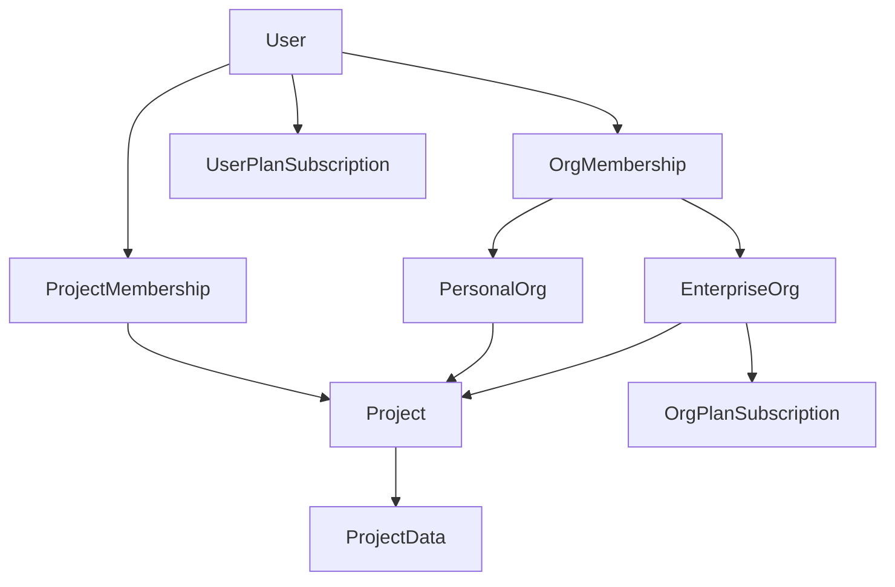

# Ownership, organizations, and billing model (design doc)

## Summary

CoRATES is a multi-tenant app where projects are the primary unit users navigate by, while organizations are the ownership and billing boundary.

Core rule: every project is owned by exactly one organization (including the user's personal organization). Users never directly own projects or data; users work on projects through organization membership.

This document defines the product policy, UX model, and system invariants for ownership, transfers, and billing. It is intentionally opinionated to avoid ambiguous "workspace" behavior.

## Goals

- Make ownership unambiguous: who owns a project, who controls access, who is billed.
- Keep primary UX project-centric: avoid "which org am I in?" friction for most users.
- Limit org management surfaces to org admins/owners; avoid exposing enterprise admin UX to regular members.
- Support both personal subscriptions and enterprise org subscriptions without implicit merging/refunds.
- Make transfers explicit, safe, and auditable.

## Non-goals (for now)

- Cross-organization projects (shared ownership).
- Organization hierarchies (parent/child orgs, cost centers).
- Automated refunds/credits or "plan merging" logic.
- Detailed pricing design (tiers and price points may be defined elsewhere).

## Terminology

- User: Individual account.
- Organization (Org): Ownership container and billing scope for projects and data.
- Personal Org: An org representing an individual user's personal workspace (created automatically).
- Enterprise Org: An org managed by admins/owners, with org-level billing and settings.
- Project: Primary user-facing object; always owned by exactly one org.
- Org membership: Relationship between a user and an org with a role.
- Entitlements: Feature access granted by subscriptions. Some are user-scoped, some org-scoped.

## Key principles (policy)

1. Projects belong to organizations; users work on projects.
2. Every object belongs to exactly one org (directly or via its project).
3. No global "current org" for core navigation. Users navigate by project.
4. Org administration is admin-only. Most users should never see enterprise admin UI.
5. Billing scope is explicit:
   - Personal plan bills the user.
   - Org plan bills the organization.
   - No implicit merging/refunds; cancellations/upgrades are explicit actions.

## Conceptual model

Notes:
- The user can have a personal subscription and be a member of one or more enterprise orgs simultaneously.
- Entitlements can be mixed: some attach to the user, some attach to the org.

## Ownership and data placement invariants

### Invariants

- Project ownership is single-org: `project.orgId` is required and immutable except via a transfer flow.
- No user-owned data: data is owned by an org (usually via project ownership).
- Org boundary is the tenant boundary: authZ checks should ultimately resolve to `orgId`.

### Data placement rule

Every persisted object must have either:
- a direct `orgId`, or
- a `projectId` that resolves to `project.orgId`.

This rule is a guardrail against accidental cross-tenant joins and makes it easier to implement:
- auditing
- export
- retention policies
- eventual SSO/policy enforcement

## Access model

### Org roles (initial)

- Owner/Admin:
  - Can manage org settings, org members, and org billing.
  - Can initiate/accept project transfers involving the org.
- Member:
  - Can create projects owned by the org.
  - Cannot see org billing or org settings pages.

### Project roles (repo-style)

Projects have their own role system independent of org membership.

- Project Owner:
  - A user who created the project (default) or was assigned ownership.
  - Manages project membership (invites/removals) and project-level settings.
- Project Member:
  - A user explicitly granted access to the project.
  - Can collaborate within the project according to their role/permissions.

Notes:
- Project roles control access to project data and actions.
- Org roles control org administration (billing, org settings, org membership) and do not automatically imply access to every project.

### Project visibility default

When an org member creates a project, they select the owning org (for ownership and billing), but:

- Project access is invite-based.
- By default, only the creator (project owner) can see the project until additional members are invited.
- Org membership alone does not grant visibility into the org's project list.

### Cross-organization collaboration

Users can be invited to collaborate on a project even if they are not members of the owning org.

- Inviting an external collaborator grants project membership, not org membership.
- External collaborators:
  - can work on the project,
  - but do not gain access to org admin surfaces or other projects owned by that org.

### Visibility

- Non-admin members should not see:
  - org billing details (invoices, payment methods)
  - org settings / management UI
- If a non-admin needs to understand why a feature is unavailable, the product should explain scope without revealing billing details:
  - "This project is controlled by the owning organization."
  - "Ask an org admin to enable this feature."

## UX and navigation model

### Project-first navigation

- Projects are the primary objects in navigation, lists, and deep links.
- Orgs are metadata displayed on projects and in project settings.
- There is no global org switcher required for the standard user experience.

### Project creation

- User selects an owning org at project creation time.
- Default selection is the user's personal org.

### Ownership visibility

Ownership should be visible in:
- project list items
- project header
- project settings
- transfer UI and confirmations

### Admin-only org management area

Org admin UX exists as a separate section accessible only to org admins/owners.

- Non-admins never see or use org management/settings pages.
- Admin entrypoint can be:
  - avatar menu item (visible only to admins/owners of any org), or
  - an "Admin" section listing orgs the user can manage

### Personal settings vs org admin

Personal settings and enterprise org administration are intentionally separate surfaces:

- Personal settings:
  - always available to the user
  - includes user profile/preferences and other individual-account settings
  - hosts User Billing for personal subscriptions
- Org admin:
  - visible only to org admins/owners
  - includes org members, org settings, and org billing

## Billing model

### Surfaces

#### User Billing (standard SaaS page)

Available to all users. Shows only:
- user personal plan tier (Free/Basic/Pro/etc.)
- personal invoices/receipts
- personal payment method
- upgrade/downgrade/cancel actions for personal subscriptions

User Billing intentionally does not show enterprise billing details or enterprise pricing.

#### Org Admin Billing (enterprise)

Visible only to org owners/admins. Shows:
- org plan tier (enterprise)
- seats / member counts
- org invoices
- org payment method
- org subscription lifecycle actions

### Billing scope

- Personal billing applies to the user account.
- Org billing applies to the organization.
- A user may be personally subscribed while also being included in one or more org plans.
- Cross-org collaborators on a project do not change project ownership or billing scope; ownership and org-scoped billing remain with the owning org.

### No implicit merging

The system must not silently:
- merge plans
- apply refunds
- auto-cancel a personal plan when enterprise entitlements exist

Instead, the product can surface explicit choices (outside the billing page if enterprise details are hidden there), such as:
- a non-financial notice in project context when a feature is controlled by org scope
- admin-facing prompts in Org Admin if personal purchases are duplicative (optional)

## Entitlements (mixed model)

CoRATES supports both user-scoped and org-scoped entitlements.

### Org-scoped entitlements (examples)

These should apply only within projects owned by that org:
- collaboration limits and policies
- audit logs retention and access policies
- institutional governance features (SSO/policies later)
- org-wide usage constraints or compliance settings

### User-scoped entitlements (examples)

These should apply to the user regardless of which org owns the project, unless explicitly restricted:
- personal add-ons (if introduced)
- personal-tier features that are not organization-governance related

### UX for feature gating

When a user encounters a locked feature:
- If the feature is org-scoped: explain "Org controlled" and guide them to ask an org admin.
- If the feature is user-scoped: guide them to User Billing upgrade flow.
- Avoid revealing enterprise pricing or billing details to non-admin members.

## Transfers / migration (project ownership change)

Transfers are explicit, user-initiated operations that change `project.orgId`.

### Transfer requirements

- Initiated by a user with adequate permissions in the source org (admin/owner).
- Accepted by a user with adequate permissions in the destination org (admin/owner).

### Transfer UX requirements

The transfer flow must clearly communicate:
- the ownership change (OrgA -> OrgB)
- access changes (who will lose access, who will gain access)
- billing responsibility change (OrgB becomes responsible for org-scoped billing for that project)
- policy impact (destination org may enforce stricter policies)

### Transfer interactions with project membership

- Transfers do not implicitly "merge" organizations.
- After transfer, existing project members may:
  - retain access (if permitted by destination org policy), or
  - lose access (if destination org requires tighter controls).
- The UI should explicitly show which collaborators will retain access vs be removed as part of the transfer.

### Transfer audit trail

Every transfer must be recorded as an immutable audit event with:
- actor
- timestamp
- source org
- destination org
- project id
- a snapshot of membership implications (best-effort)

## Common scenarios (expected behavior)

### Personal-only user

- Has a personal org and may have a personal plan.
- Sees project-first navigation.
- Uses User Billing to manage personal plan.
- Never sees org admin UX.

### Member of an enterprise org (non-admin)

- Can work on org-owned projects.
- Does not see org billing or org settings.
- If gated by org-scoped entitlements, sees "Org controlled" guidance.
- If gated by user-scoped entitlements, sees personal upgrade guidance.
- Access to specific projects is controlled by project membership; org membership alone is not sufficient.

### Enterprise org admin/owner

- Can manage org members, settings, and org billing in Org Admin.
- Can initiate and accept transfers.
- Still has User Billing for personal plan if they choose to subscribe personally.

## Open questions (to finalize)

1. Entitlement mapping: which CoRATES features are user-scoped vs org-scoped today?
2. External collaborators: should there be any restrictions on inviting users from outside the owning org (admin-only, allow by default, allowlist domains later)?

## Rollout notes

- Start by enforcing the invariants in the data model and authZ checks.
- Build project-first UX and ownership visibility.
- Add transfer flow with audit logging (even if minimal at first).
- Introduce org admin surfaces for enterprise only when needed; keep them hidden from non-admins.
