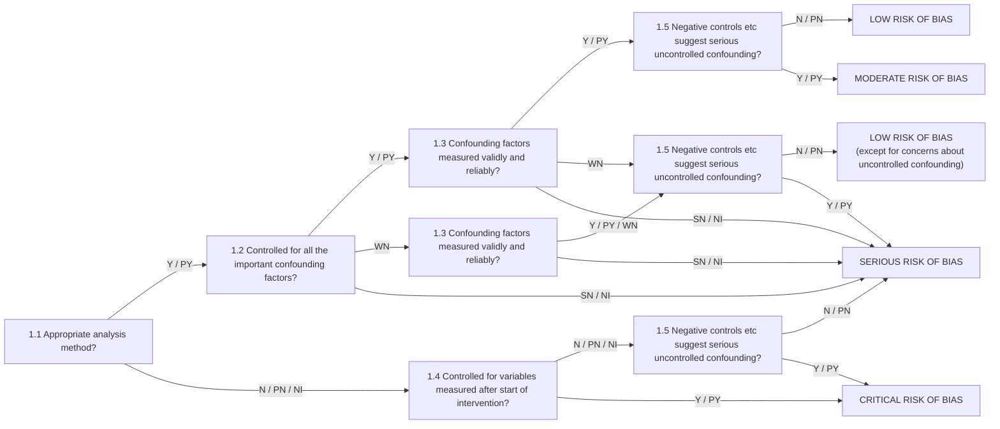

```mermaid
flowchart LR
  %% --------------------
  %% Core questions
  %% --------------------
  Q1["1.1 Appropriate analysis method?"]
  Q2["1.2 Controlled for all the important confounding factors?"]
  Q3a["1.3 Confounding factors measured validly and reliably?"]
  Q3b["1.3 Confounding factors measured validly and reliably?"]
  Q4["1.4 Controlled for variables measured after start of intervention?"]

  %% --------------------
  %% Negative controls
  %% --------------------
  NC1["1.5 Negative controls etc suggest serious uncontrolled confounding?"]
  NC2["1.5 Negative controls etc suggest serious uncontrolled confounding?"]
  NC3["1.5 Negative controls etc suggest serious uncontrolled confounding?"]

  %% --------------------
  %% Outcomes
  %% --------------------
  LOW["LOW RISK OF BIAS"]
  LOW_EX["LOW RISK OF BIAS\n(except for concerns about uncontrolled confounding)"]
  MOD["MODERATE RISK OF BIAS"]
  SER["SERIOUS RISK OF BIAS"]
  CRIT["CRITICAL RISK OF BIAS"]

  %% --------------------
  %% Paths from 1.1
  %% --------------------
  Q1 -- "Y / PY" --> Q2
  Q1 -- "N / PN / NI" --> Q4

  %% --------------------
  %% Paths from 1.2
  %% --------------------
  Q2 -- "Y / PY" --> Q3a
  Q2 -- "WN" --> Q3b
  Q2 -- "SN / NI" --> SER

  %% --------------------
  %% Paths from 1.3 (top)
  %% --------------------
  Q3a -- "Y / PY" --> NC1
  Q3a -- "WN" --> NC2
  Q3a -- "SN / NI" --> SER

  %% --------------------
  %% Paths from 1.3 (middle)
  %% --------------------
  Q3b -- "Y / PY / WN" --> NC2
  Q3b -- "SN / NI" --> SER

  %% --------------------
  %% Paths from 1.4
  %% --------------------
  Q4 -- "N / PN / NI" --> NC3
  Q4 -- "Y / PY" --> CRIT

  %% --------------------
  %% Negative controls to outcomes
  %% --------------------
  NC1 -- "N / PN" --> LOW
  NC1 -- "Y / PY" --> MOD

  NC2 -- "N / PN" --> LOW_EX
  NC2 -- "Y / PY" --> SER

  NC3 -- "N / PN" --> SER
  NC3 -- "Y / PY" --> CRIT
```
