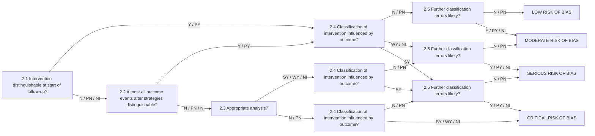

```mermaid
flowchart LR
  %% --------------------
  %% Start
  %% --------------------
  A1["2.1 Intervention distinguishable at start of follow-up?"]

  %% --------------------
  %% Early pathway
  %% --------------------
  A2["2.2 Almost all outcome events after strategies distinguishable?"]
  A3["2.3 Appropriate analysis?"]

  %% --------------------
  %% Classification influenced by outcome
  %% --------------------
  C1["2.4 Classification of intervention influenced by outcome?"]
  C2["2.4 Classification of intervention influenced by outcome?"]
  C3["2.4 Classification of intervention influenced by outcome?"]

  %% --------------------
  %% Further errors
  %% --------------------
  E1["2.5 Further classification errors likely?"]
  E2["2.5 Further classification errors likely?"]
  E3["2.5 Further classification errors likely?"]

  %% --------------------
  %% Outcomes
  %% --------------------
  LOW["LOW RISK OF BIAS"]
  MOD["MODERATE RISK OF BIAS"]
  SER["SERIOUS RISK OF BIAS"]
  CRIT["CRITICAL RISK OF BIAS"]

  %% --------------------
  %% Connections
  %% --------------------
  A1 -- "Y / PY" --> C1
  A1 -- "N / PN / NI" --> A2

  A2 -- "Y / PY" --> C1
  A2 -- "N / PN / NI" --> A3

  A3 -- "SY / WY / NI" --> C2
  A3 -- "N / PN" --> C3

  %% --------------------
  %% Classification → errors
  %% --------------------
  C1 -- "N / PN" --> E1
  C1 -- "WY / NI" --> E2
  C1 -- "SY" --> E3

  C2 -- "N / PN" --> E2
  C2 -- "SY" --> E3

  C3 -- "N / PN" --> E3
  C3 -- "SY / WY / NI" --> CRIT

  %% --------------------
  %% Error nodes → outcomes
  %% --------------------
  E1 -- "N / PN" --> LOW
  E1 -- "Y / PY / NI" --> MOD

  E2 -- "N / PN" --> MOD
  E2 -- "Y / PY / NI" --> SER

  E3 -- "N / PN" --> SER
  E3 -- "Y / PY / NI" --> CRIT
```
